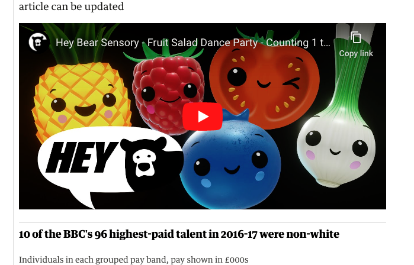
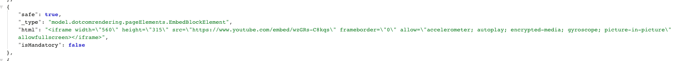
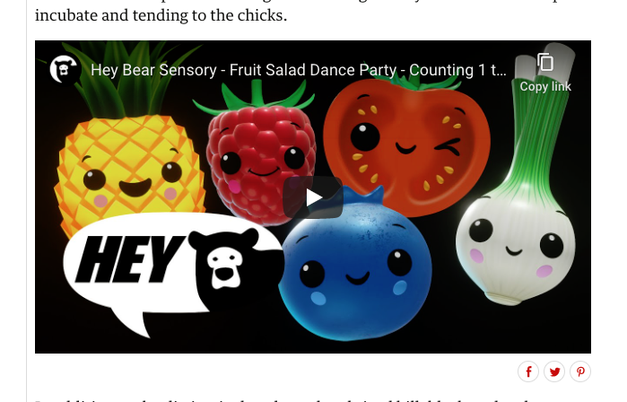
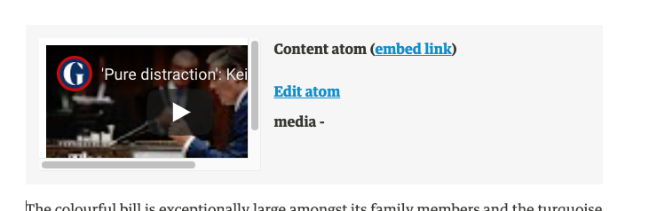
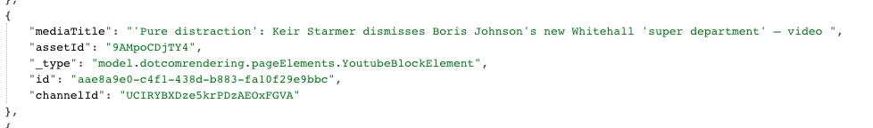

# The many states of YouTube videos

As of 23rd June 2020

## The 'Embed'

YouTube embed code (an iframe basically)

### Composer

### Frontend

### CAPI

### DCR Json

## The 'Structured Data Embed'

Pasted into composer via a YouTube URL, Composer converts it to structured data using Embedly.

### Composer

### Frontend

### CAPI

### DCR Json

_Not Supported_

## The 'Media Atom'

Using [Media Atom maker tool](https://video.gutools.co.uk/), embedded into composer with the directed integration. Highly structured data, uses YouTube for publishers under the hood.

### Composer

### Frontend

### CAPI

### DCR Json

