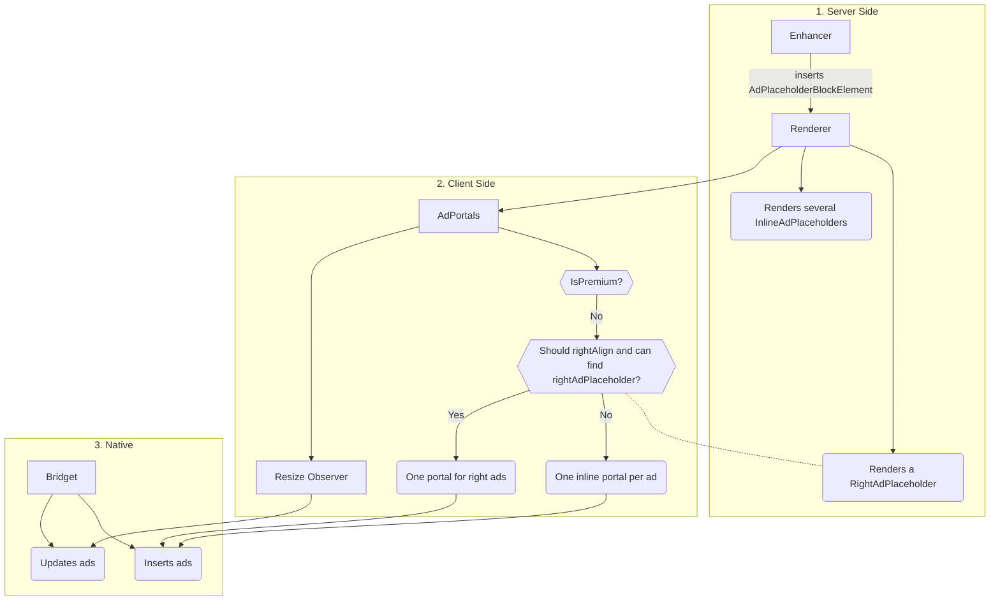

# Apps Ads
Ads on Apps, are inserted through the native layer via Bridget.


## Server-side
- An [enhance-ads enhancer][1] runs on the server. This calculates when ads should be inserted into an article and inserts a `AdPlaceholderBlockElement` element into the model.

- The `AdPlaceholderBlockElement` elements are rendered as an [AdPlaceholder][2] during the server render.

- Some article types (currently `Live` and `Standard` article types), also render a [RightAdPlaceholder within the right column][3]

## Client-side
- AdPortals are rendered on Apps articles
	- [e.g Standard Articles][4]

- On first render, this [checks][5], via Bridget, if the client is premium.
	- If the client is premium, we don't want to show ads, so don't do anything
	- Otherwise, we query the DOM for, and then store a ref for the RightAdsPlaceholder, and for each InlineAdPlaceholder.
- We use the `rightAlignFrom` prop to determine if we should be attempting to render the ads in the right placeholder
	- If so, and we are able to find the right ad placeholder we create a single portal for the right aligned adverts and include the individual adverts inside it (spaced out using flexbox) as below:
	```
			.________._________________.________.
			|        |_________________|        |
			|        |_________________|########|
			|        |_________________|        |
			|        |_________________|        |
			|        |_________________|########|
			|________|_________________|________|

	```

	- If we shouldn't be right aligning the ads (either the screen is too small, or we couldn't find the RightAdPlaceholder) create individual portals for each inline advert as below:
	```
			  .________________.
			  |________________|
			  |################|
			  |________________|
			  |________________|
			  |################|
			  .________________.

	```

	- After the first render, we use the stored ad slot references to calculate each ad slots position on the page, and pass these to the native layer (via bridget) so that it can [insert the ads][6].
	- A resize observer monitors changes in the clients height and passes updated ad positions to Bridget if both the client height and the ad coordinates have changed it we can [update the ads][7]


[1]: https://github.com/guardian/dotcom-rendering/blob/main/dotcom-rendering/src/model/enhance-ad-placeholders.ts
[2]: https://github.com/guardian/dotcom-rendering/blob/main/dotcom-rendering/src/lib/renderElement.tsx#L479
[3]: https://github.com/guardian/dotcom-rendering/blob/main/dotcom-rendering/src/layouts/LiveLayout.tsx#L1148
[4]: https://github.com/guardian/dotcom-rendering/blob/main/dotcom-rendering/src/layouts/StandardLayout.tsx#L484
[5]: https://github.com/guardian/dotcom-rendering/blob/main/dotcom-rendering/src/components/AdPortals.importable.tsx#L116
[6]: https://github.com/guardian/dotcom-rendering/blob/main/dotcom-rendering/src/components/AdPortals.importable.tsx#L143
[7]: https://github.com/guardian/dotcom-rendering/blob/main/dotcom-rendering/src/components/AdPortals.importable.tsx#L152
