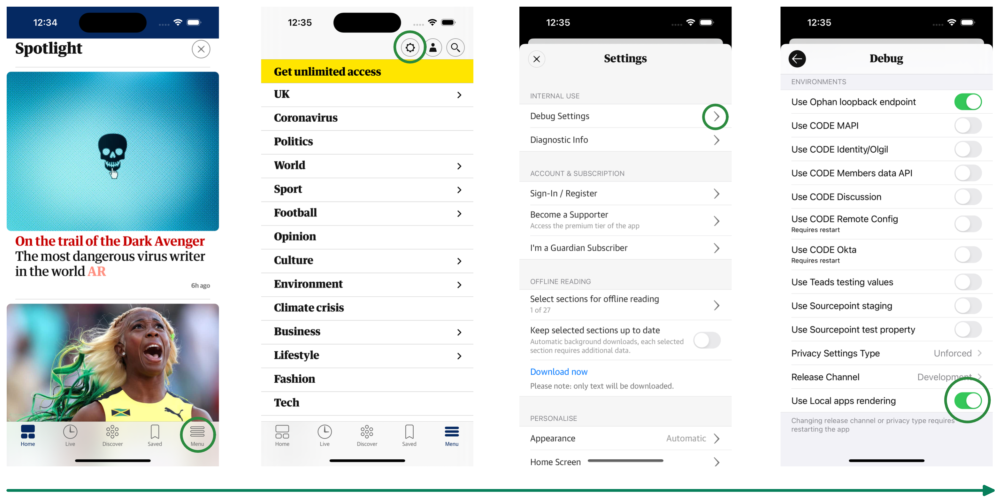
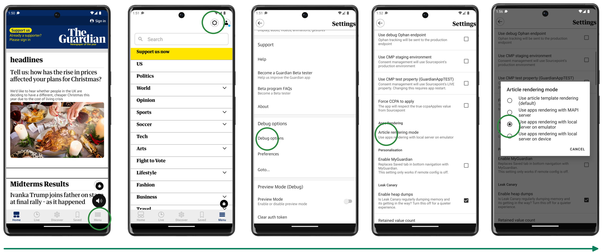
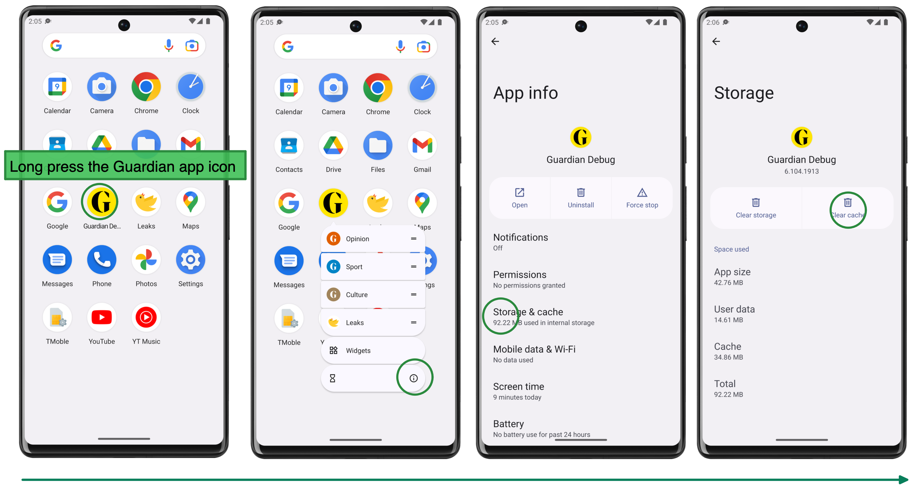

# Apps Testing

Some functionality of apps articles is only available when the article is viewed
from the Guardian app. This document will show you how to test with a device
simulator and DCR running locally.

## iOS

1. Clone the iOS app from
   [`guardian/ios-live`](https://github.com/guardian/ios-live), and follow the
   setup instructions
2. Run DCR locally on port `3030`
3. From Xcode, run the app in a device simulator
4. Once the app is running, navigate to the debug settings and enable "Use Local
   apps rendering":

5. From the app settings menu, "Clear Cached Data"
6. Return to the app's Home screen and select any article with the "AR" badge.
   It will be rendered by the local DCR server.
    - Articles without the AR badge will be rendered using the legacy templates

## Android

1. Clone the Android app from
   [`guardian/android-news-app`](https://github.com/guardian/android-news-app)
   and follow the setup instructions
2. Run DCR locally on port `3030`
3. From Android Studio, run the app in a device simulator
4. Once the app is running, navigate to the debug settings and enable "Use apps
   rendering with local server on emulator"

5. [Clear the Android app cache](#clear-the-app-cache)

### Clear the app cache

