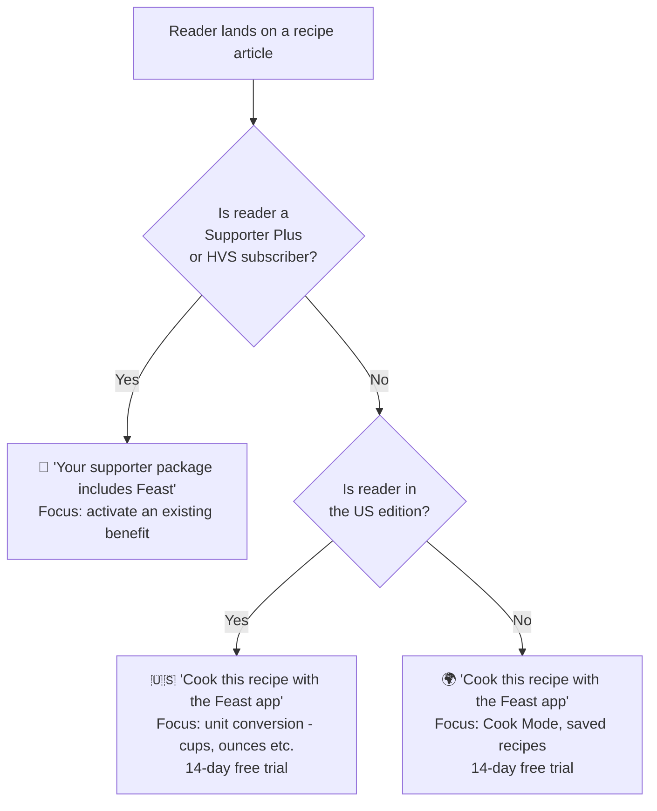
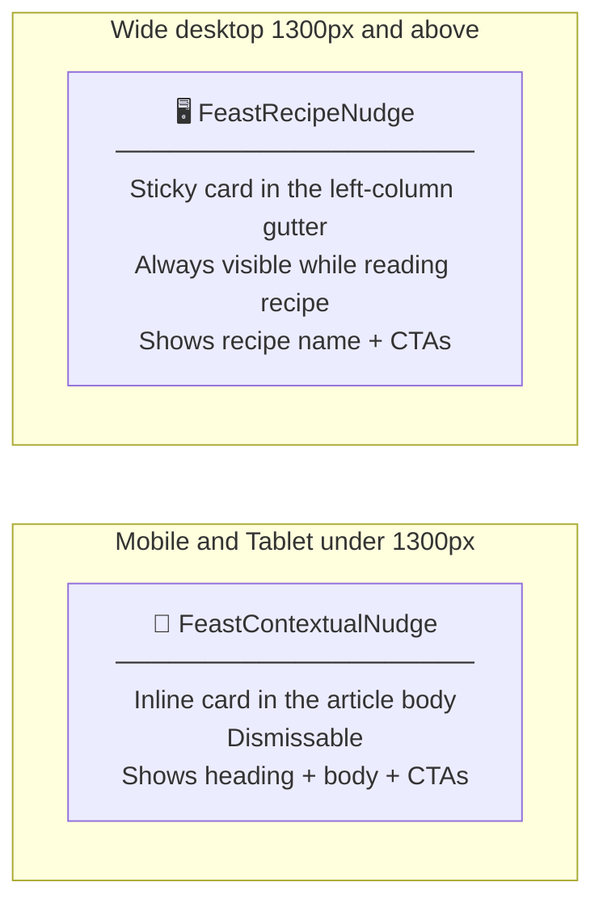
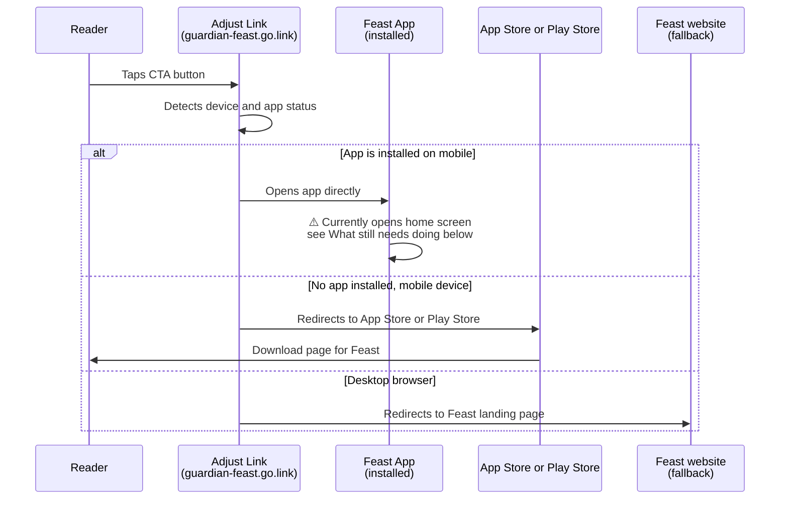
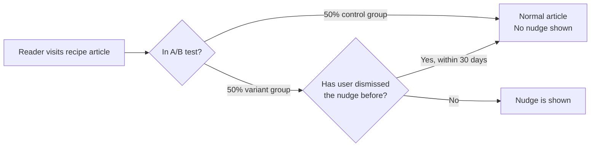
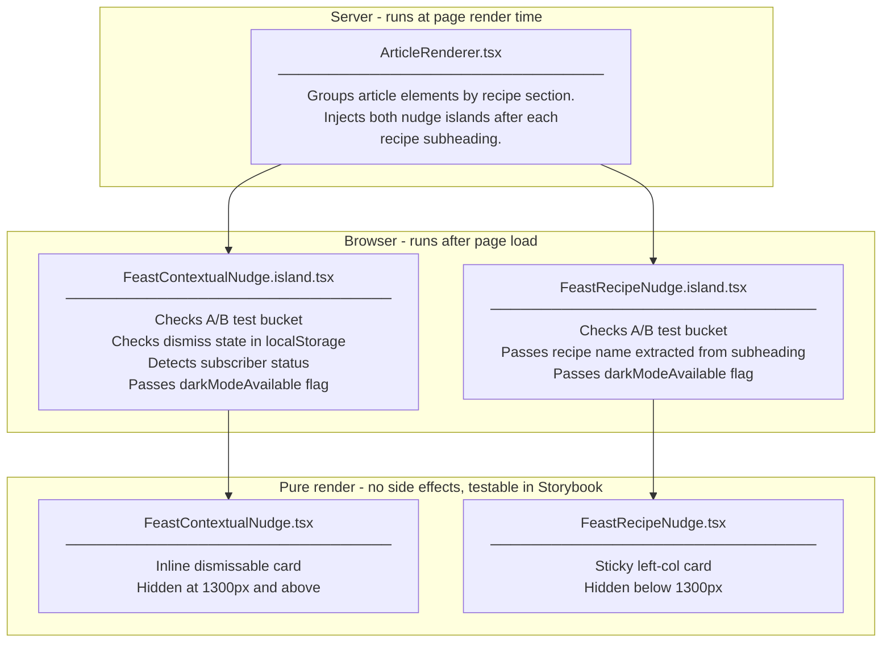
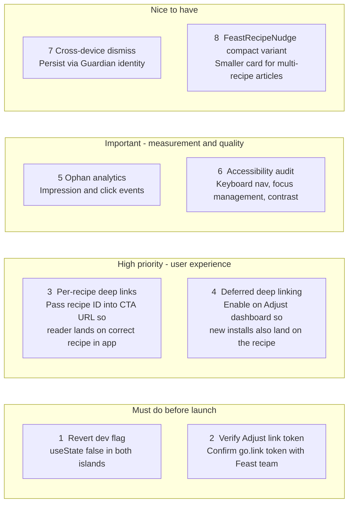
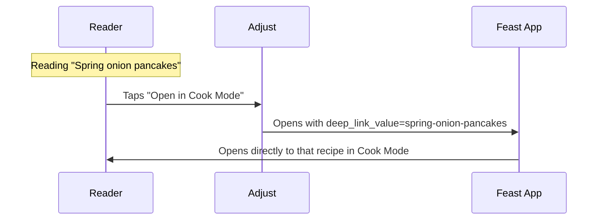
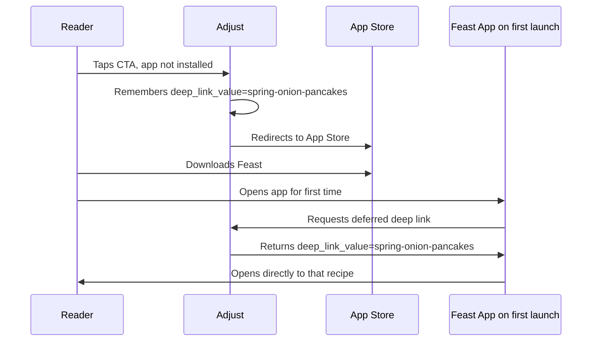

# Feast Recipe Nudges

> **In one sentence:** Small, well-timed prompts on Guardian recipe pages that invite readers to cook the same recipe inside the Feast app - appearing naturally in the moment the reader is most likely to want it.

These components promote the [Guardian Feast app](https://www.theguardian.com/food/feast-app) with two goals:

1. **Grow app installs** - invite readers who don't have the app yet to try it free for 14 days
2. **Activate Supporter Plus benefits** - remind existing subscribers that Feast is already included in their package

---

## Why recipe pages?

A reader actively cooking from a Guardian recipe on the web is already the ideal Feast user. They have demonstrated clear intent. The app features - Cook Mode (keeps the screen on hands-free), ingredient unit conversion, saved recipe collections - are most compelling _while the reader is reading the recipe_, not before or after.

This is **contextual targeting**, not demographic targeting. We don't interrupt browsing; we offer a relevant upgrade at the moment of highest intent.

---

## Who sees what?

The copy shown in the nudge is personalised based on two signals: whether the reader is a paying subscriber, and which edition they are in.



---

## The two components

Two complementary components work together. They are **mutually exclusive by screen size** - exactly one is visible at any given viewport width, never both at the same time.



### On mobile and tablet - `FeastContextualNudge`

The card is injected **inline in the article**, directly after the recipe title (subheading). It has a dismiss button so readers who don't want it can permanently close it.

| Feature               | Detail                                                                                                                  |
| --------------------- | ----------------------------------------------------------------------------------------------------------------------- |
| Position              | Inline, in the article flow                                                                                             |
| Dismissal             | One tap hides it for **30 days** (stored locally in the browser)                                                        |
| Multi-recipe articles | First recipe: full heading + body + buttons. Second recipe onwards: buttons only (avoids repeating the marketing pitch) |
| Hides at              | 1300px and above (the sticky left-col card takes over)                                                                  |

### On wide desktop - `FeastRecipeNudge`

The card lives in the **220px gutter to the left of the article body**. It is sticky - it follows the reader as they scroll down through the recipe, and silently disappears when they scroll past the end of that recipe section. There is no dismiss button; the card is ambient, not intrusive.

This pattern is directly borrowed from **The Filter** (the Guardian's product-review section), where a product card sticks alongside each reviewed product as the reader scrolls past it.

---

## How the page layout works

### Mobile and tablet view

```
┌─────────────────────────────────┐
│  Article header / hero image    │
├─────────────────────────────────┤
│  Article intro text …           │
│                                 │
│  ## Recipe Title                │  ← recipe subheading
│  ┌─────────────────────────┐    │
│  │ 🌿  Feast               │    │  ← FeastContextualNudge (inline)
│  │ Cook this recipe with   │    │     visible on mobile/tablet only
│  │ the Feast app           │    │
│  │ [Open in Cook Mode]     │    │
│  │ [Save to My Feast]   ✕  │    │
│  └─────────────────────────┘    │
│                                 │
│  Ingredients …                  │
│  Method steps …                 │
└─────────────────────────────────┘
```

### Wide desktop view

```
  Left gutter (220px)   │   Article body (620px)
  ────────────────────  │  ─────────────────────────────────
                        │   Article header / hero image
                        │   Article intro text …
                        │
  ┌──────────────────┐  │   ## Spring onion pancakes
  │ 🌿 Feast         │  │
  │                  │  │   Ingredients:
  │ Spring onion     │  │   • 200g plain flour
  │ pancakes         │  │   • 3 spring onions
  │                  │  │   • 1 tsp salt
  │ ──────────────── │  │
  │ [Open Cook Mode] │  │   Method:
  │ [Save to Feast]  │  │   1. Mix the flour with …
  │                  │  │   2. Fold in the spring …
  └──────────────────┘  │   3. Heat a pan over …
  ↑ card sticks here    │
    while scrolling     │   (card disappears here)
    through this recipe │
                        │   ## Sesame dipping sauce
  ┌──────────────────┐  │
  │ 🌿 Feast         │  │   Ingredients …
  │                  │  │
  │ Sesame dipping   │  │
  │ sauce            │  │
  │ ──────────────── │  │
  │ [Open Cook Mode] │  │
  │ [Save to Feast]  │  │
  └──────────────────┘  │
```

Each recipe section in a multi-recipe article gets its own independent sticky card, showing that recipe's name.

---

## How the CTAs work - Adjust deep links

When a reader taps a button, where they end up depends on whether they have the Feast app installed:



### UTM tracking parameters

Every link includes UTM parameters so we can measure performance in analytics:

| Parameter      | Value                              | Purpose                 |
| -------------- | ---------------------------------- | ----------------------- |
| `utm_medium`   | `ACQUISITIONS_NUDGE`               | Channel                 |
| `utm_source`   | `GUARDIAN_WEB`                     | Source site             |
| `utm_campaign` | e.g. `FeastNudge_Default_CookMode` | Which button was tapped |
| `utm_content`  | Article page ID                    | Which article           |

---

## A/B test

The nudges are not shown to everyone. They are gated behind an A/B test so we can measure their impact before a full rollout.



**Test details:**

| Field           | Value                                                                 |
| --------------- | --------------------------------------------------------------------- |
| Test ID         | `FeastContextualNudge`                                                |
| Split           | 50% control / 50% variant                                             |
| Start           | 2026-04-24                                                            |
| Expiry          | 2027-01-01                                                            |
| Success metrics | CTA click-through rate, Feast app installs, Supporter Plus activation |

---

## Component architecture



The **Island pattern** is how DCR defers interactive components. The island wrapper runs only in the browser (never on the server), which keeps the initial page load fast. The pure render component is a plain React component - easy to test and preview in Storybook independently of any A/B test.

---

## Dark mode

Both components fully support dark mode. On recipe articles the dark background matches the style of the support banner at the bottom of the article.

| Scenario                                         | Mechanism                                                                                        |
| ------------------------------------------------ | ------------------------------------------------------------------------------------------------ |
| **Production** - reader's OS is set to dark mode | `@media (prefers-color-scheme: dark)` CSS rule. Only active if the page type supports dark mode. |
| **Storybook** - explicit dark decorator applied  | `[data-color-scheme='dark']` CSS attribute selector.                                             |

Pages that do not support dark mode (e.g. Guardian Labs commercial content) are never accidentally darkened - the media query is only injected when the page explicitly opts in.

---

## What still needs to be done



### 1. Revert the dev-only flag _(must do before merging to production)_

Both island files contain a temporary shortcut so the component is visible during development without being placed in the A/B test variant:

```ts
// Change this in BOTH island files before merging:
const [shouldRender, setShouldRender] = useState(true);
//                                               ^^^^
//                                        change to false
```

When set to `false`, the `useEffect` will correctly gate rendering on the A/B test check.

---

### 2. Verify the Adjust link token

The link currently hardcodes `p0nQT` as the Adjust token:

```
https://guardian-feast.go.link/p0nQT?...
```

This needs to be confirmed with the Feast or Growth engineering team as the correct production token. If the token differs between staging and production, it should be read from a config value rather than hardcoded.

---

### 3. Per-recipe deep link values _(highest product impact)_

**The problem today:**

Every CTA currently sends the user to the Feast app's home screen - not to the specific recipe the reader was just reading.

**What a deep link enables:**



Adjust supports a `deep_link_value` URL parameter that routes the user to a specific piece of content. The DCR code already has a placeholder comment in `buildAppLink` marking exactly where to add it. What is needed:

-   **Feast team:** Expose a recipe identifier from the `frontend` backend, attached to each recipe subheading element.
-   **DCR:** Pass that ID through `ArticleRenderer` → island → component → `buildAppLink`.

---

### 4. Deferred deep linking for new installs

**The problem today:**

When a reader taps a CTA and does _not_ have Feast installed, they go to the App Store. After downloading and opening the app for the first time, they land on the home screen - not the recipe that sent them there.

**The fix - Adjust deferred deep linking:**



**No code changes needed in DCR.** This is entirely an Adjust dashboard configuration and Feast app SDK concern.

---

### 5. Ophan analytics events

The nudges currently fire no analytics events. To measure the A/B test properly, both components should call `submitComponentEvent` for:

-   **Impression** - when the nudge enters the viewport
-   **Click** - when any CTA button is tapped

This uses the same Ophan integration already present in the Reader Revenue banner and other acquisition components in DCR.

---

### 6. Accessibility audit

Before full rollout, the components need a formal review covering:

-   Keyboard navigation through the sticky left-col card CTAs
-   Focus management after dismissing the inline card (focus should return to a logical element, not get lost)
-   Screen reader announcement of the dismiss action
-   Colour contrast ratios in dark mode verified against WCAG 2.1 AA

---

### 7. Cross-device dismiss persistence

The 30-day dismiss is stored in the browser's `localStorage`. A reader who dismisses on their phone will see the nudge again on their laptop. For a seamless experience, dismissal could be persisted server-side against the reader's Guardian identity (for signed-in users), using the same mechanism as other acquisition messaging in DCR.

---

### 8. `FeastRecipeNudge` compact variant

The inline `FeastContextualNudge` has a `compact` mode that shows only the CTA buttons - no heading or body copy - on the 2nd, 3rd, … recipe sections of a multi-recipe article, avoiding repetitive copy.

The sticky `FeastRecipeNudge` does not yet have an equivalent. Every instance shows the full card. This is fine for most articles (each card shows a different recipe name), but a slimmer variant may be worth exploring.

---

## File map

```
src/components/
  FeastContextualNudge.tsx          Pure render - inline dismissable card
  FeastContextualNudge.island.tsx   A/B gate · dismiss logic · subscriber detection
  FeastContextualNudge.stories.tsx  Storybook (light + dark, all copy variants)

  FeastRecipeNudge.tsx              Pure render - sticky left-col card
                                    Also exports layout helpers used by ArticleRenderer:
                                      recipeContentContainerStyles
                                      recipeLeftColContainerStyles
                                      stripHtmlTags
  FeastRecipeNudge.island.tsx       A/B gate wrapper
  FeastRecipeNudge.stories.tsx      Storybook (light + dark, in-section context)

src/experiments/tests/
  feast-contextual-nudge.ts         A/B test definition (id, split, expiry)

src/experiments/
  ab-tests.ts                       feastContextualNudge registered here

src/lib/
  ArticleRenderer.tsx               Groups recipe elements by subheading section;
                                    injects both nudge islands per section

docs/
  feast-recipe-nudges.md            This document
```
