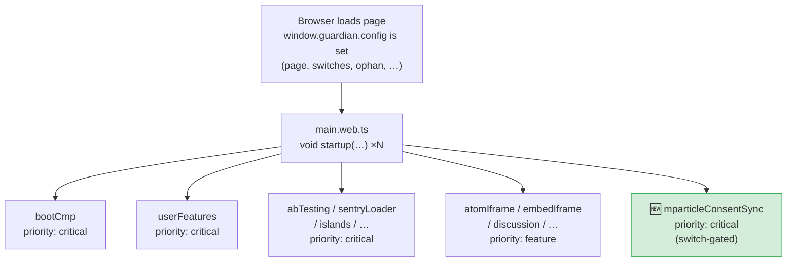
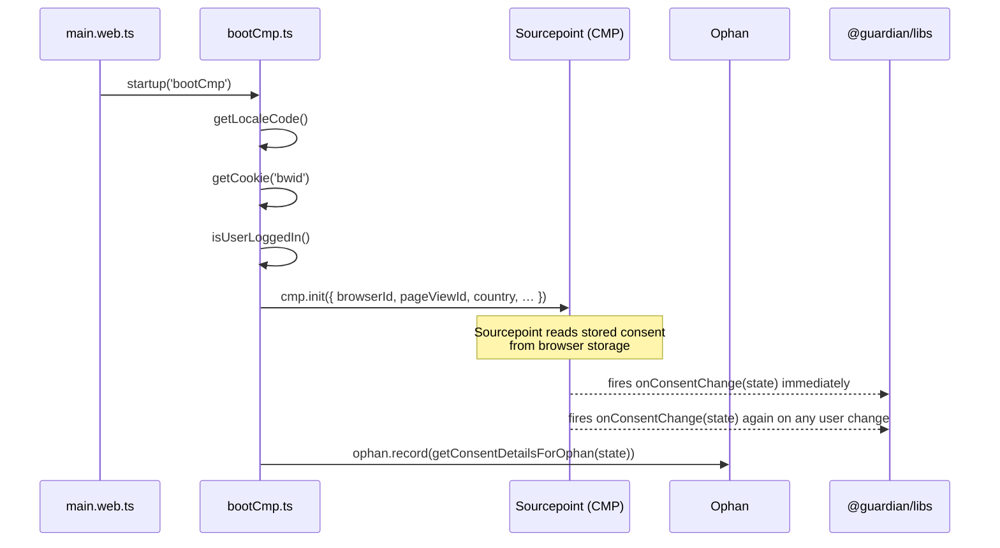
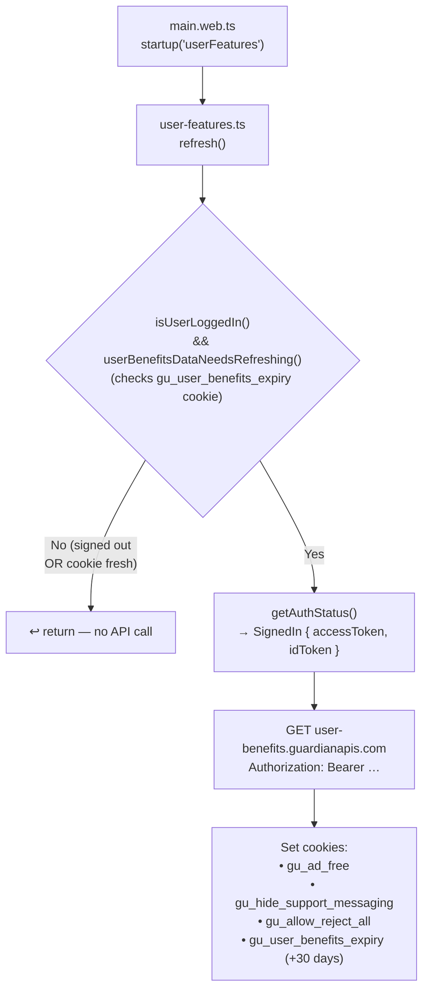
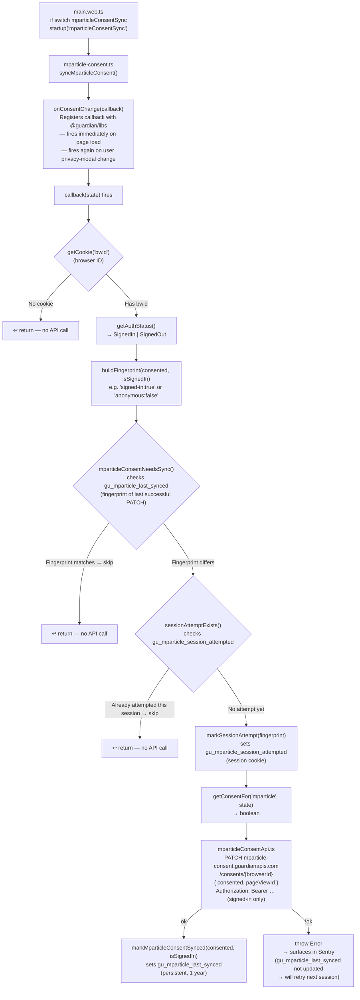
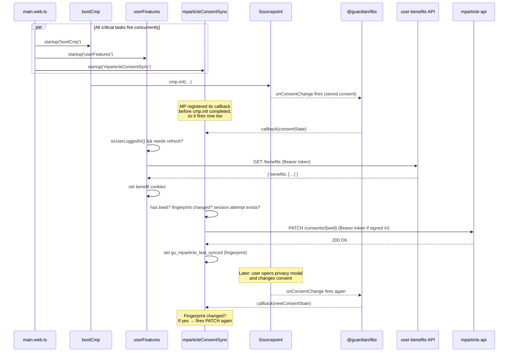
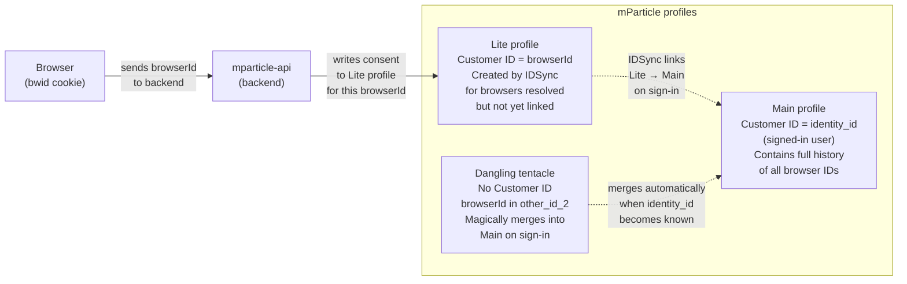

# mParticle – Paid Media Integration (Frontend)

> **Task:** [Frontend task](https://app.asana.com/1/1210045093164357/project/1213134855566811/task/1213702578213622)  
> **Related tasks:** [Backend task](https://app.asana.com/0/0/1213430985786431) | [Connection task](https://app.asana.com/0/0/1213430985786437)

## Overview

MRR (Marketing Reader Revenue) want to connect mParticle to Meta (Facebook Ads) and Google Ads audiences. To legally send user data to those platforms, mParticle must hold a record of the user's current consent state under GDPR.

The browser is the source of truth for consent (via Sourcepoint / our CMP). When a user's consent state is relevant to the paid-media use-case (i.e. on a new session or when they change their consent), dotcom-rendering must call a new backend endpoint so that mParticle can be updated with the current browser-consent record. The call is made for **all users** (both anonymous and signed-in) so that mParticle can use the `bwid` browser ID for identity resolution in the data lake. When the user is signed in, a Bearer token is also included so the backend can immediately link the record to the user's `identity_id`.

## Why dotcom-rendering?

dotcom-rendering is the primary front-end renderer for theguardian.com. It already:

-   Boots and owns the CMP lifecycle via [`bootCmp.ts`](../src/client/bootCmp.ts)
-   Reads the `bwid` cookie (browser ID) and passes it to analytics/CMP contexts
-   Manages user authentication state via [`lib/identity.ts`](../src/lib/identity.ts) (`getAuthStatus`, `isUserLoggedIn`)
-   Makes authenticated API calls to backend services (see the `userBenefitsApi` pattern in [`client/userFeatures/`](../src/client/userFeatures/))
-   Hooks into the startup pipeline via [`client/main.web.ts`](../src/client/main.web.ts) and the `startup()` scheduler

All of these primitives already exist and are reusable. The mParticle sync is a new, independent task that fits naturally alongside `userFeatures`.

## How existing flows work — and where we fit in

### Page startup pipeline

Every page load, `main.web.ts` fires a set of `startup()` tasks concurrently. Each task is a named, prioritised async module load. `critical` tasks run immediately; `feature` tasks are deferred.



---

### Existing flow 1 — CMP boot (`bootCmp`)

`bootCmp` owns the consent management lifecycle. It initialises Sourcepoint with the user's locale, browser ID and page view ID. After that, Sourcepoint reads the stored consent from the browser and fires `onConsentChange` once immediately; it fires again whenever the user changes their choices in the privacy modal.



`onConsentChange` is a _pub/sub_: any module can register a callback with `onConsentChange(cb)` and will be called (1) once on page load with the current stored state, and (2) again each time the user changes their consent in the modal.

---

### Existing flow 2 — User features refresh (`userFeatures`)

`userFeatures` decides whether to call the `user-benefits` API. It avoids calling on every page load using a staleness cookie (`gu_user_benefits_expiry`). The API returns the user's benefits (ad-free, hideSupportMessaging, allowRejectAll), which are persisted to short-lived cookies read by other scripts.



---

### New flow — mParticle consent sync (`mparticleConsentSync`)

This is the new module. It is structurally identical to `userFeatures` but hooks into `onConsentChange` instead of running once on startup, and calls a different API endpoint.



---

### Parallel view — all three flows on the same page load

The three `critical` tasks all start concurrently. `bootCmp` and `mparticleConsentSync` both depend on `onConsentChange`, which Sourcepoint fires only after `cmp.init()` completes. The mParticle callback therefore always runs _after_ consent is available from Sourcepoint, regardless of the startup ordering.



---

### mParticle identity model — why `browserId` matters

Understanding _which_ mParticle profile receives the consent write is important. mParticle has three profile types:



The backend uses the **`identity_id` from the Bearer token JWT** (not the browser ID) to confirm who the signed-in user is. It then writes the consent to the Lite profile keyed by `browserId`. The Lite profile is the source of truth for browser-consent state until IDSync merges it into the Main profile.

## Scope of frontend work

The frontend is **only** responsible for:

1. Detecting the right moment to call the API (new session, consent change, or auth-state change).
2. Reading the current consent state for the specific purpose needed.
3. Reading the `bwid` cookie (browser ID) and the `pageViewId`.
4. Calling `PATCH /consents/{browserId}` on the new backend endpoint with the appropriate payload.
5. Attaching the Bearer token when the user is signed in (but proceeding without it for anonymous users).

The frontend does **not** write to mParticle directly. That is the backend's responsibility.

## API contract (Frontend → Backend)

```
PATCH https://mparticle-consent.guardianapis.com/consents/{browserId}
Authorization: Bearer <access-token>   ← only present for signed-in users
X-GU-IS-OAUTH: true                    ← only present for signed-in users
Content-Type: application/json

{
  "consented": true | false,
  "pageViewId": "<ophan pageViewId>"
}
```

-   `browserId` – the value of the `bwid` cookie (string). This is the identifier that mParticle stores in the `other_id_2` / `Other ID 2` user identity field.
-   `consented` – boolean reflecting whether the user has consented to the relevant GDPR purpose.
-   `pageViewId` – taken from `window.guardian.config.ophan.pageViewId`. Useful as an audit trail / evidence of the user's choice.

Authentication is **optional**. When the user is signed in, `Authorization: Bearer <access_token>` and `X-GU-IS-OAUTH: true` are attached (via `getOptionsHeaders` in [`lib/identity.ts`](../src/lib/identity.ts)), allowing the backend to immediately link the record to the user's `identity_id`. For anonymous users, the headers are omitted and the backend records the consent against the `bwid` alone for later identity resolution.

## When to call the API

The spec says: **when a user starts a new session**, **when they change their consent**, or **when their auth state changes** (e.g. they sign in while already having a consent value stored).

Practically, the cleanest mapping onto the existing architecture is:

| Trigger                            | Mechanism                                                                                                                                      |
| ---------------------------------- | ---------------------------------------------------------------------------------------------------------------------------------------------- |
| New session / first visit          | `gu_mparticle_last_synced` is absent or holds a different fingerprint → fires                                                                  |
| Consent changes                    | `onConsentChange` fires again with new state → fingerprint changes → fires                                                                     |
| User signs in (same consent value) | Auth state changes from anonymous → signed-in → fingerprint changes (e.g. `"anonymous:false"` → `"signed-in:false"`) → fires with Bearer token |

### Avoiding API hammering

`onConsentChange` fires **every time** consent is read from the browser (i.e. on every page view), not only when the user actively changes something. Calling the mParticle API on every page view would overwhelm the endpoint.

The solution is a **fingerprint-based dual-cookie approach** that fires only when the state has genuinely changed:

#### `gu_mparticle_last_synced` (persistent, 1-year TTL)

Stores the fingerprint of the last **successful** PATCH. The fingerprint encodes both the consent value and whether the user was signed in at the time:

```
"signed-in:true"   // signed-in user who consented
"signed-in:false"  // signed-in user who rejected
"anonymous:true"   // anonymous user who consented
"anonymous:false"  // anonymous user who rejected
```

On `onConsentChange`, the current fingerprint is computed and compared. If it matches the stored value, no call is made. This means:

-   Reloading the same page with the same consent and same auth state → **skipped**
-   Changing consent → new fingerprint → **fires**
-   Signing in with the same consent value → auth state in fingerprint changes → **fires** (with Bearer token, allowing the backend to link the record to `identity_id` immediately)

#### `gu_mparticle_session_attempted` (session cookie, no TTL)

Stores the fingerprint of the most recent PATCH **attempt** in the current browser session. This exists solely to cap retries on failure: if a PATCH fails, `gu_mparticle_last_synced` is not updated (so the state looks "unsynced") but the session-attempt cookie prevents a retry on every subsequent page load. The retry happens on the next browser session.

The attempt cookie is written **before** the network call so that a mid-flight page unload does not leave the next load unaware that a call was in progress.

## Which consent to send

> **TBC with MRR/Data Privacy team** – the exact GDPR purpose name must be confirmed.

The consent framework maps named vendors to IAB TCF vendor IDs via the `VendorIDs` registry in `@guardian/libs`. `getConsentFor` only accepts a `VendorName` — a key of that registry. The current registry does not include `mparticle`, so **before this feature ships, a PR must be raised against the [csnx repo](https://github.com/guardian/csnx)** to add `mparticle` (or whatever the agreed purpose name turns out to be) to `VendorIDs`.

> ⚠️ **This is a runtime throw, not just a TypeScript error.** The `getConsentFor` implementation looks up the vendor in `VendorIDs` at runtime and throws if it is not found:
>
> ```js
> if (typeof sourcepointIds === 'undefined' || sourcepointIds.length === 0) {
> 	throw new Error(
> 		`Vendor '${vendor}' not found, or with no Sourcepoint ID…`,
> 	);
> }
> ```
>
> The `as VendorName` cast silences the compiler but does not prevent this throw. **The `mparticleConsentSync` switch must not be enabled in any environment until the `csnx` PR is merged, `@guardian/libs` is bumped in DCR, and the mParticle vendor has been added to the Sourcepoint dashboard by Data Privacy.**

The mParticle Sourcepoint vendor ID is **`62470f577e1e3605d5bc0b8a`** (confirmed from the Guardian's Sourcepoint privacy-manager-view API, 2026-03-27, `vendorType: CUSTOM`). This ID feeds directly into the `csnx` PR.

For example, the Braze integration uses:

```ts
import { getConsentFor, onConsentChange } from '@guardian/libs';

onConsentChange((state) => {
	const consented = getConsentFor('braze', state);
	// ...
});
```

`'braze'` is a key in `VendorIDs` and maps to a list of IAB TCF vendor IDs that Sourcepoint checks consent against.

Until the `@guardian/libs` PR is merged and the package version is bumped here, the implementation casts the purpose key:

```ts
export const MPARTICLE_CONSENT_PURPOSE = 'mparticle' as VendorName;
```

This keeps TypeScript happy temporarily, but the cast must be removed once `mparticle` is a real entry in `VendorIDs`.

## Implementation plan

### 1. New API client module

Create `src/client/mparticle/mparticleConsentApi.ts` (analogous to `userBenefitsApi.ts`):

```ts
import { getOptionsHeaders, type AuthStatus } from '../../lib/identity';

export const syncConsentToMparticle = async (
	authStatus: AuthStatus,
	browserId: string,
	consented: boolean,
	pageViewId: string,
): Promise<void> => {
	const baseUrl = window.guardian.config.page.mparticleApiUrl;
	if (!baseUrl) throw new Error('mparticleApiUrl is not defined');

	const url = `${baseUrl}/consents/${encodeURIComponent(browserId)}`;

	// Attach Bearer token when available; anonymous calls are permitted without auth
	const authHeaders =
		authStatus.kind === 'SignedIn'
			? getOptionsHeaders(authStatus).headers
			: {};

	const response = await fetch(url, {
		method: 'PATCH',
		mode: 'cors',
		headers: {
			'Content-Type': 'application/json',
			...authHeaders,
		},
		body: JSON.stringify({ consented, pageViewId }),
	});

	if (!response.ok) {
		throw new Error(
			`mParticle consent sync failed: ${response.statusText}`,
		);
	}
};
```

### 2. Fingerprint cookies

Create `src/client/mparticle/cookies/mparticleConsentSynced.ts`:

```ts
import { getCookie, setCookie } from '@guardian/libs';

// Persistent cookie (1 year): stores the fingerprint of the last *successful* PATCH.
// Format: "signed-in:{true|false}" or "anonymous:{true|false}"
export const MPARTICLE_LAST_SYNCED_COOKIE = 'gu_mparticle_last_synced';

// Session cookie (no TTL): records that we already attempted a PATCH for this fingerprint
// in the current session, so failed calls are retried at most once per session.
export const MPARTICLE_SESSION_ATTEMPTED_COOKIE =
	'gu_mparticle_session_attempted';

export const buildFingerprint = (
	consented: boolean,
	isSignedIn: boolean,
): string => `${isSignedIn ? 'signed-in' : 'anonymous'}:${consented}`;

export const mparticleConsentNeedsSync = (
	consented: boolean,
	isSignedIn: boolean,
): boolean => {
	const lastSynced = getCookie({ name: MPARTICLE_LAST_SYNCED_COOKIE });
	return lastSynced !== buildFingerprint(consented, isSignedIn);
};

export const sessionAttemptExists = (fingerprint: string): boolean =>
	getCookie({ name: MPARTICLE_SESSION_ATTEMPTED_COOKIE }) === fingerprint;

export const markSessionAttempt = (fingerprint: string): void => {
	setCookie({
		name: MPARTICLE_SESSION_ATTEMPTED_COOKIE,
		value: fingerprint,
		// No daysToLive → session cookie; cleared when the browser tab closes
	});
};

export const markMparticleConsentSynced = (
	consented: boolean,
	isSignedIn: boolean,
): void => {
	setCookie({
		name: MPARTICLE_LAST_SYNCED_COOKIE,
		value: buildFingerprint(consented, isSignedIn),
		daysToLive: 365,
	});
};
```

### 3. Orchestration module

Create `src/client/mparticle/mparticle-consent.ts`:

```ts
import { getConsentFor, getCookie, onConsentChange } from '@guardian/libs';
import type { VendorName } from '@guardian/libs';
import { getAuthStatus } from '../../lib/identity';
import {
	buildFingerprint,
	markMparticleConsentSynced,
	markSessionAttempt,
	mparticleConsentNeedsSync,
	sessionAttemptExists,
} from './cookies/mparticleConsentSynced';
import { syncConsentToMparticle } from './mparticleConsentApi';

export const MPARTICLE_CONSENT_PURPOSE: VendorName = 'mparticle';

export const syncMparticleConsent = (): void => {
	onConsentChange(async (state) => {
		// Fail fast: bwid is always required, available for all users
		const browserId = getCookie({ name: 'bwid', shouldMemoize: true });
		if (!browserId) return;

		const authStatus = await getAuthStatus();
		const isSignedIn = authStatus.kind === 'SignedIn';
		const consented = getConsentFor(MPARTICLE_CONSENT_PURPOSE, state);
		const fingerprint = buildFingerprint(consented, isSignedIn);

		// Skip if the last successful PATCH recorded the same state
		if (!mparticleConsentNeedsSync(consented, isSignedIn)) return;

		// Skip if we already attempted this fingerprint in the current session
		if (sessionAttemptExists(fingerprint)) return;

		// Record the attempt before the network call
		markSessionAttempt(fingerprint);

		const pageViewId = window.guardian.config.ophan.pageViewId;
		await syncConsentToMparticle(
			authStatus,
			browserId,
			consented,
			pageViewId,
		);

		// Only written on success
		markMparticleConsentSynced(consented, isSignedIn);
	});
};
```

### 4. Wire into the startup pipeline

In [`src/client/main.web.ts`](../src/client/main.web.ts), add alongside the `userFeatures` startup entry:

```ts
void startup(
	'mparticleConsentSync',
	() =>
		import('./mparticle/mparticle-consent').then(
			({ syncMparticleConsent }) => syncMparticleConsent(),
		),
	{ priority: 'critical' },
);
```

Using `priority: 'critical'` ensures it runs alongside CMP boot and user features, not after lazy-loaded features.

### 5. Add `mparticleApiUrl` to the page config

`mparticleApiUrl` is environment-specific and must be injected server-side into the page config, exactly as `userBenefitsApiUrl` already is. It is not hardcoded in the frontend bundle.

The type is already declared in [`src/model/guardian.ts`](../src/model/guardian.ts):

```ts
mparticleApiUrl?: string;
```

The property is carried through `unknownConfig` in `createGuardian` (the same pass-through mechanism used by all other page config values that originate from the backend/Frontend app). The backend team needs to include `mparticleApiUrl` in the page config response.

Expected values by environment:

| Environment | Value                                             |
| ----------- | ------------------------------------------------- |
| PROD        | `https://mparticle-consent.guardianapis.com`      |
| CODE        | `https://mparticle-consent-code.guardianapis.com` |

For local development, the value is already set in [`fixtures/config.js`](../fixtures/config.js):

```js
mparticleApiUrl: 'https://mparticle-consent.guardianapis.com',
```

This fixture config is used by the local dev server and Storybook. It uses the PROD URL, consistent with all other API URLs in that file (`idapi.theguardian.com`, `discussion.theguardian.com`, etc.).

### 6. Feature switch

Add a switch `mparticleConsentSync` to the `Switches` interface in [`src/types/config.ts`](../src/types/config.ts) (or rely on the existing free-form `[key: string]: boolean | undefined` index signature), and guard the startup call:

```ts
if (window.guardian.config.switches.mparticleConsentSync) {
    void startup('mparticleConsentSync', ...);
}
```

This allows the feature to be toggled via the existing switch infrastructure without a code deploy.

## Files to create / modify

| Action     | File                                                                                             |
| ---------- | ------------------------------------------------------------------------------------------------ |
| **Create** | `src/client/mparticle/mparticleConsentApi.ts`                                                    |
| **Create** | `src/client/mparticle/cookies/mparticleConsentSynced.ts`                                         |
| **Create** | `src/client/mparticle/mparticle-consent.ts`                                                      |
| **Create** | `src/client/mparticle/mparticle-consent.test.ts`                                                 |
| **Modify** | `src/client/main.web.ts` – add startup entry, switch-gated                                       |
| **Modify** | `src/model/guardian.ts` – add `mparticleApiUrl` to `config.page`                                 |
| **Modify** | `src/types/config.ts` – add `mparticleConsentSync` switch (optional, or rely on index signature) |

## Tests

`mparticle-consent.test.ts` is a **pure orchestration test**. All sub-modules and external dependencies are mocked so that the tests verify only the branching logic in the orchestrator, not the internals of any individual module.

Mock boundaries:

-   `@guardian/libs` — `onConsentChange`, `getConsentFor`, `getCookie` all mocked individually. `onConsentChange` captures its callback so tests can invoke it directly.
-   `../../lib/identity` — `getAuthStatus` mocked
-   `./mparticleConsentApi` — `syncConsentToMparticle` mocked
-   `./cookies/mparticleConsentSynced` — `buildFingerprint`, `mparticleConsentNeedsSync`, `sessionAttemptExists`, `markSessionAttempt`, `markMparticleConsentSynced` all mocked

Use `jest.clearAllMocks()` (not `jest.resetAllMocks()`) in `beforeEach`. `clearAllMocks` resets call history and per-test return values but preserves the mock factory implementations supplied to `jest.mock()` — which is required for the `onConsentChange` callback capture to keep working across tests.

Test cases:

-   When `bwid` cookie is absent → `syncConsentToMparticle` not called
-   When `mparticleConsentNeedsSync()` returns false → `syncConsentToMparticle` not called
-   When `sessionAttemptExists()` returns true → `syncConsentToMparticle` not called
-   `markSessionAttempt` is called **before** `syncConsentToMparticle` (order verified)
-   Signed-in user → `syncConsentToMparticle` called with `SignedIn` auth status, `browserId`, `consented: true`, and `pageViewId`
-   Anonymous (signed-out) user → `syncConsentToMparticle` called with `SignedOut` auth status (no Bearer token attached)
-   When consent is false → `syncConsentToMparticle` called with `consented: false`
-   Correct consent purpose key is passed to `getConsentFor`
-   `markSessionAttempt` called with the computed fingerprint
-   After successful sync → `markMparticleConsentSynced` called with `(consented, isSignedIn)`
-   On API failure → `markMparticleConsentSynced` not called, error propagates (surfaces in Sentry)
-   Anonymous → signed-in with same consent value → fingerprint changes → `syncConsentToMparticle` fires with `SignedIn` auth status

## Key architectural decisions and their rationale

### Why not call on every `onConsentChange`?

`onConsentChange` from `@guardian/libs` fires on every page load (not only when the user actively changes their consent). Calling the mParticle API on every page load would produce an enormous volume of requests, likely hitting rate limits and causing unnecessary load on the backend infrastructure. The staleness-cookie approach, already proven for `userBenefitsApi`, limits calls to once per session.

### Why all users, not just signed-in?

The backend uses the `bwid` browser ID for identity resolution in the data lake. Anonymous browsers are recorded against their `bwid` and linked to a `identity_id` overnight once the user signs in or is resolved by the data lake. If we only called the API for signed-in users, we would miss the consent state for all anonymous sessions, leaving the mParticle records incomplete until identity resolution catches up.

Sending the Bearer token when available (signed-in users) is a security addition: the backend can immediately verify the caller's `identity_id` and write consent to the corresponding main profile without waiting for overnight resolution. For anonymous users, the backend records the consent against the `bwid` alone.

The backend confirmed: Bearer auth is optional. The only essential identifier is `browserId`.

### Why pass `browserId` in the URL path (not as a claim)?

The backend cannot derive the browser ID from the auth token – it only knows the identity ID. The browser ID is needed so the backend can write the consent to the corresponding mParticle "Lite" profile (browser-keyed) for users who have not yet triggered identity resolution. Sending it explicitly in the URL is clean and auditable.

### Why `PATCH`?

The operation is idempotent – it is setting a known state, not appending an event. `PATCH` is the correct HTTP verb for a partial update to a resource, and the backend spec agrees.

### Why attach auth only when signed in (not require it)?

The call must work for anonymous users too (see rationale above). Using the same `getOptionsHeaders` helper as `userBenefitsApi` when the user is signed in keeps the pattern consistent and gives the backend the `identity_id` from the JWT when available. For anonymous callers, the headers are simply omitted — the backend accepts the call with `bwid` alone.

### Why add `mparticleApiUrl` to `window.guardian.config.page`?

The URL is environment-specific (different for CODE, PROD, and DEV). Injecting it server-side, just like `userBenefitsApiUrl`, avoids hardcoding per-environment values in the front-end bundle and keeps the pattern consistent.

## Open questions (frontend-relevant)

| Question                                                                  | Status                                                                                |
| ------------------------------------------------------------------------- | ------------------------------------------------------------------------------------- |
| Which exact GDPR purpose name should be used with `getConsentFor()`?      | ✅ Agreed: `'mparticle'` — `csnx` PR #2347 merged, `@guardian/libs` bumped to 31.0.0  |
| Should the call be made for all users or signed-in only?                  | ✅ Agreed: all users — anonymous browsers use `bwid` for later identity resolution    |
| What is the correct hostname for the new consent lambda?                  | ✅ Agreed: `mparticle-consent.guardianapis.com` (dedicated lambda for consent writes) |
| Should the call also be made on `apps` rendering target (`main.apps.ts`)? | Likely no – scoped to web for now                                                     |
| Should failures be silently swallowed or surfaced to Sentry?              | ✅ Surfacing via existing Sentry integration (error thrown, not caught)               |

## Manual testing (local)

### Prerequisites

1. **Backend endpoint is deployed to CODE** — the frontend can't test end-to-end before the `PATCH /consents/{browserId}` endpoint is live on `mparticle-consent-code.guardianapis.com`.
2. **Feature switch enabled** — the startup entry is guarded by `window.guardian.config.switches.mparticleConsentSync`. Enable it in [`fixtures/switch-overrides.js`](../fixtures/switch-overrides.js) to ungate it locally:

```js
mparticleConsentSync: true,
```

3. Optionally override the URL to CODE in [`fixtures/config-overrides.js`](../fixtures/config-overrides.js):

```js
mparticleApiUrl: 'https://mparticle-consent-code.guardianapis.com',
```

### Steps

1. Start the local dev server (`make dev` or `pnpm dev`).
2. In the browser, open DevTools → Application → Cookies. **Delete** `gu_mparticle_last_synced` and `gu_mparticle_session_attempted` if present (this resets the fingerprint gate).
3. Open any article page — you do **not** need to be signed in; the call fires for all users.
4. In the **Network** tab, filter by `consents`. You should see a `PATCH` request to `https://mparticle-consent-code.guardianapis.com/consents/<your-bwid>` with:
    - Status `200` (or appropriate success code from the backend)
    - Body: `{ "consented": true/false, "pageViewId": "..." }`
    - For anonymous users: no `Authorization` header
    - For signed-in users: `Authorization: Bearer ...` header present
5. Reload the page. Because `gu_mparticle_last_synced` now matches the current fingerprint, **no second request** should fire.
6. Delete `gu_mparticle_last_synced`. Reload. The request fires again.
7. To test the consent-change path: open the CMP modal (Privacy Settings in the footer), toggle consent, and save. A new request should fire (fingerprint changes).
8. To test the sign-in path: while signed out, note the `gu_mparticle_last_synced` value (e.g. `anonymous:false`). Sign in. On next page load the fingerprint becomes `signed-in:false` → request fires with Bearer token.

### Confirming the right mParticle profile was updated

After a successful call, ask a backend engineer or check the mParticle sandbox UI to verify the consent attribute was written to the Lite profile for your `bwid` value.

## Relationship to other work

-   **Backend:** Creates the `PATCH /consents/{browserId}` endpoint on `mparticle-api.support.guardianapis.com`, handles mParticle writes, user auth, and rate limiting concerns (SQS queue, secondary data store). Frontend only consumes it.
-   **Connection mParticle → Meta/Google:** Configured entirely within mParticle and the ad-platform UIs. No DCR work needed.
-   **Backfill (TBC):** A separate data-engineering concern. No DCR work needed.

## Reference: existing patterns used

| Pattern                            | Source in this repo                                                                                                 |
| ---------------------------------- | ------------------------------------------------------------------------------------------------------------------- |
| `onConsentChange` usage            | [`src/lib/braze/hasRequiredConsents.ts`](../src/lib/braze/hasRequiredConsents.ts)                                   |
| Authenticated API call             | [`src/client/userFeatures/userBenefitsApi.ts`](../src/client/userFeatures/userBenefitsApi.ts)                       |
| Staleness cookie                   | [`src/client/userFeatures/cookies/userBenefitsExpiry.ts`](../src/client/userFeatures/cookies/userBenefitsExpiry.ts) |
| `isUserLoggedIn` / `getAuthStatus` | [`src/lib/identity.ts`](../src/lib/identity.ts)                                                                     |
| `bwid` cookie read                 | [`src/client/bootCmp.ts`](../src/client/bootCmp.ts)                                                                 |
| `pageViewId`                       | `window.guardian.config.ophan.pageViewId`                                                                           |
| Startup wiring                     | [`src/client/main.web.ts`](../src/client/main.web.ts)                                                               |
| Per-page config URL injection      | [`src/model/guardian.ts`](../src/model/guardian.ts) (`config.page.userBenefitsApiUrl`)                              |
