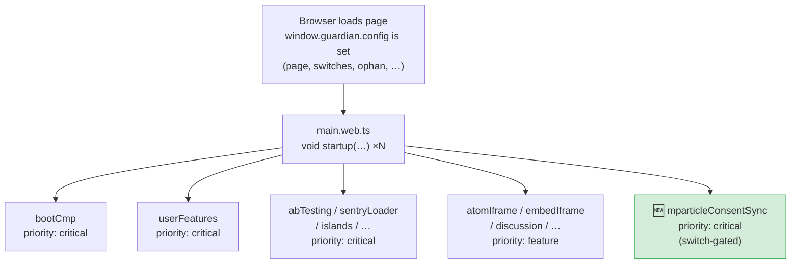
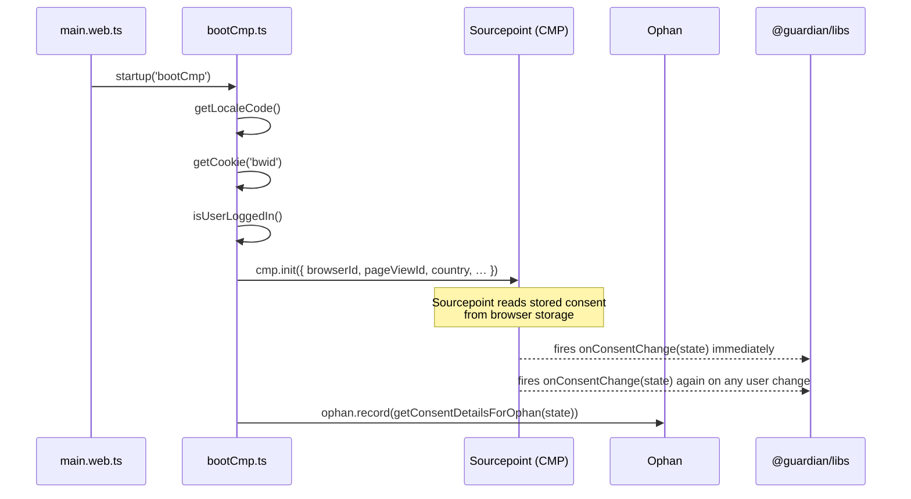
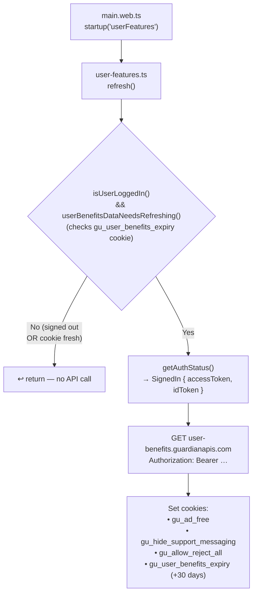
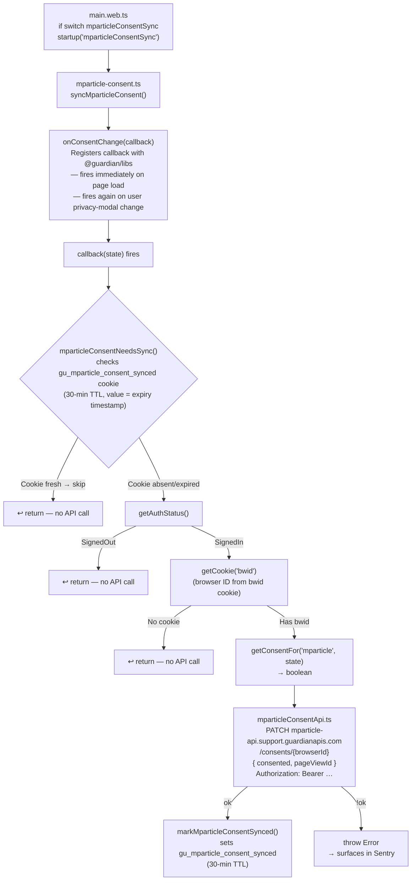
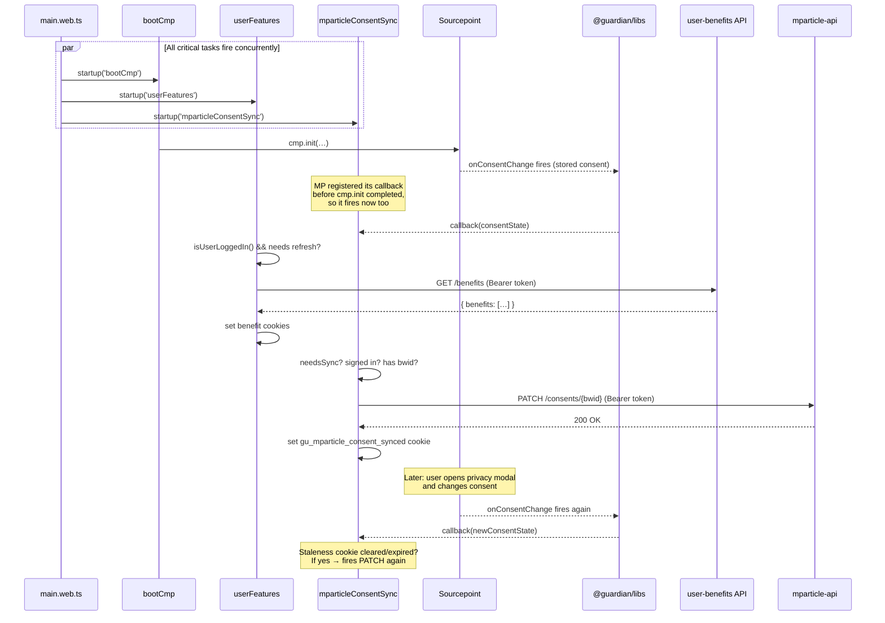
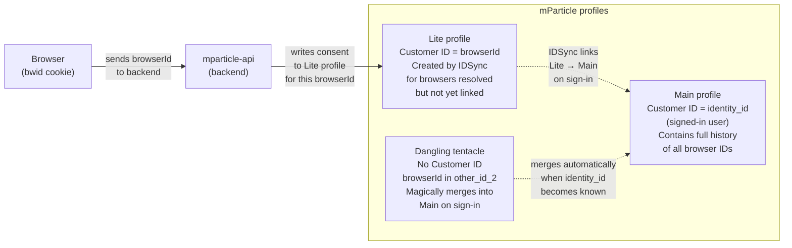

# mParticle – Paid Media Integration (Frontend)

> **Task:** [Frontend task](https://app.asana.com/1/1210045093164357/project/1213134855566811/task/1213702578213622)  
> **Related tasks:** [Backend task](https://app.asana.com/0/0/1213430985786431) | [Connection task](https://app.asana.com/0/0/1213430985786437)

## Overview

MRR (Marketing Reader Revenue) want to connect mParticle to Meta (Facebook Ads) and Google Ads audiences. To legally send user data to those platforms, mParticle must hold a record of the user's current consent state under GDPR.

The browser is the source of truth for consent (via Sourcepoint / our CMP). When a **signed-in user**'s consent state is relevant to the paid-media use-case (i.e. on sign-in, on new session, or when they change their consent), dotcom-rendering must call a new backend endpoint so that mParticle can be updated with the current browser-consent record.

## Why dotcom-rendering?

dotcom-rendering is the primary front-end renderer for theguardian.com. It already:

-   Boots and owns the CMP lifecycle via [`bootCmp.ts`](../src/client/bootCmp.ts)
-   Reads the `bwid` cookie (browser ID) and passes it to analytics/CMP contexts
-   Manages user authentication state via [`lib/identity.ts`](../src/lib/identity.ts) (`getAuthStatus`, `isUserLoggedIn`)
-   Makes authenticated API calls to backend services (see the `userBenefitsApi` pattern in [`client/userFeatures/`](../src/client/userFeatures/))
-   Hooks into the startup pipeline via [`client/main.web.ts`](../src/client/main.web.ts) and the `startup()` scheduler

All of these primitives already exist and are reusable. The mParticle sync is a new, independent task that fits naturally alongside `userFeatures`.

## How existing flows work — and where we fit in

### Page startup pipeline

Every page load, `main.web.ts` fires a set of `startup()` tasks concurrently. Each task is a named, prioritised async module load. `critical` tasks run immediately; `feature` tasks are deferred.



---

### Existing flow 1 — CMP boot (`bootCmp`)

`bootCmp` owns the consent management lifecycle. It initialises Sourcepoint with the user's locale, browser ID and page view ID. After that, Sourcepoint reads the stored consent from the browser and fires `onConsentChange` once immediately; it fires again whenever the user changes their choices in the privacy modal.



`onConsentChange` is a _pub/sub_: any module can register a callback with `onConsentChange(cb)` and will be called (1) once on page load with the current stored state, and (2) again each time the user changes their consent in the modal.

---

### Existing flow 2 — User features refresh (`userFeatures`)

`userFeatures` decides whether to call the `user-benefits` API. It avoids calling on every page load using a staleness cookie (`gu_user_benefits_expiry`). The API returns the user's benefits (ad-free, hideSupportMessaging, allowRejectAll), which are persisted to short-lived cookies read by other scripts.



---

### New flow — mParticle consent sync (`mparticleConsentSync`)

This is the new module. It is structurally identical to `userFeatures` but hooks into `onConsentChange` instead of running once on startup, and calls a different API endpoint.



---

### Parallel view — all three flows on the same page load

The three `critical` tasks all start concurrently. `bootCmp` and `mparticleConsentSync` both depend on `onConsentChange`, which Sourcepoint fires only after `cmp.init()` completes. The mParticle callback therefore always runs _after_ consent is available from Sourcepoint, regardless of the startup ordering.



---

### mParticle identity model — why `browserId` matters

Understanding _which_ mParticle profile receives the consent write is important. mParticle has three profile types:



The backend uses the **`identity_id` from the Bearer token JWT** (not the browser ID) to confirm who the signed-in user is. It then writes the consent to the Lite profile keyed by `browserId`. The Lite profile is the source of truth for browser-consent state until IDSync merges it into the Main profile.

## Scope of frontend work

The frontend is **only** responsible for:

1. Detecting the right moment to call the API (sign-in, new session, or consent change for a signed-in user).
2. Reading the current consent state for the specific purpose needed.
3. Reading the `bwid` cookie (browser ID) and the `pageViewId`.
4. Calling `PATCH /consents/{browserId}` on the new backend endpoint with the appropriate payload.

The frontend does **not** write to mParticle directly. That is the backend's responsibility.

## API contract (Frontend → Backend)

```
PATCH https://mparticle-api.support.guardianapis.com/consents/{browserId}
Authorization: Bearer <access-token>
X-GU-IS-OAUTH: true
Content-Type: application/json

{
  "consented": true | false,
  "pageViewId": "<ophan pageViewId>"
}
```

-   `browserId` – the value of the `bwid` cookie (string). This is the identifier that mParticle stores in the `other_id_2` / `Other ID 2` user identity field.
-   `consented` – boolean reflecting whether the user has consented to the relevant GDPR purpose.
-   `pageViewId` – taken from `window.guardian.config.ophan.pageViewId`. Useful as an audit trail / evidence of the user's choice.

Authentication follows the same pattern as `userBenefitsApi`: attach `Authorization: Bearer <access_token>` and `X-GU-IS-OAUTH: true` from `getOptionsHeaders(signedInAuthStatus)` in [`lib/identity.ts`](../src/lib/identity.ts).

## When to call the API

The spec says: **when a user signs in**, **when a signed-in user starts a new session**, or **when a signed-in user changes their consents**.

Practically, the cleanest mapping onto the existing architecture is:

| Trigger                     | Mechanism                                                                                                                      |
| --------------------------- | ------------------------------------------------------------------------------------------------------------------------------ |
| User signs in / new session | Already handled by the `userFeatures` refresh gate. Mirror the same "needs refreshing?" staleness-cookie approach (see below). |
| Consent changes             | `onConsentChange` callback from `@guardian/libs`, but _only_ when the user is signed in.                                       |

### Avoiding API hammering

`onConsentChange` fires **every time** consent is read from the browser (i.e. on every page view), not only when the user actively changes something. Calling the mParticle API on every page view would overwhelm the endpoint.

The solution (mirroring `userBenefitsApi`) is a **staleness cookie**:

-   After a successful call, set a short-lived cookie (e.g. `gu_mparticle_consent_synced`, expiry ~30 minutes or per-session).
-   On `onConsentChange`, only make the API call if:
    1. The user is signed in (`isUserLoggedIn()`), AND
    2. The staleness cookie is absent (i.e. this is a new session / first visit since sign-in / consent update).

For genuine in-session consent _changes_ (user opens the privacy modal and toggles), the CMP emits a second `onConsentChange` call after the new choice is saved. We can distinguish this from the initial page-load read by comparing the consent state to what was stored at the last sync (or simply by clearing the staleness cookie when the CMP modal is dismissed with a new choice – the CMP already emits a different event for this, if needed).

The simplest acceptable implementation: use the same cookie-expiry approach as `userBenefitsDataNeedsRefreshing()`, with a short TTL so it re-syncs at least once per session.

## Which consent to send

> **TBC with MRR/Data Privacy team** – the exact GDPR purpose name must be confirmed.

The consent framework maps named vendors to IAB TCF vendor IDs via the `VendorIDs` registry in `@guardian/libs`. `getConsentFor` only accepts a `VendorName` — a key of that registry. The current registry does not include `mparticle`, so **before this feature ships, a PR must be raised against the [csnx repo](https://github.com/guardian/csnx)** to add `mparticle` (or whatever the agreed purpose name turns out to be) to `VendorIDs`.

> ⚠️ **This is a runtime throw, not just a TypeScript error.** The `getConsentFor` implementation looks up the vendor in `VendorIDs` at runtime and throws if it is not found:
>
> ```js
> if (typeof sourcepointIds === 'undefined' || sourcepointIds.length === 0) {
> 	throw new Error(
> 		`Vendor '${vendor}' not found, or with no Sourcepoint ID…`,
> 	);
> }
> ```
>
> The `as VendorName` cast silences the compiler but does not prevent this throw. **The `mparticleConsentSync` switch must not be enabled in any environment until the `csnx` PR is merged, `@guardian/libs` is bumped in DCR, and the mParticle vendor has been added to the Sourcepoint dashboard by Data Privacy.**

The mParticle Sourcepoint vendor ID is **`62470f577e1e3605d5bc0b8a`** (confirmed from the Guardian's Sourcepoint privacy-manager-view API, 2026-03-27, `vendorType: CUSTOM`). This ID feeds directly into the `csnx` PR.

For example, the Braze integration uses:

```ts
import { getConsentFor, onConsentChange } from '@guardian/libs';

onConsentChange((state) => {
	const consented = getConsentFor('braze', state);
	// ...
});
```

`'braze'` is a key in `VendorIDs` and maps to a list of IAB TCF vendor IDs that Sourcepoint checks consent against.

Until the `@guardian/libs` PR is merged and the package version is bumped here, the implementation casts the purpose key:

```ts
export const MPARTICLE_CONSENT_PURPOSE = 'mparticle' as VendorName;
```

This keeps TypeScript happy temporarily, but the cast must be removed once `mparticle` is a real entry in `VendorIDs`.

## Implementation plan

### 1. New API client module

Create `src/client/mparticle/mparticleConsentApi.ts` (analogous to `userBenefitsApi.ts`):

```ts
import { getOptionsHeaders, type SignedIn } from '../../lib/identity';

export const syncConsentToMparticle = async (
	signedInAuthStatus: SignedIn,
	browserId: string,
	consented: boolean,
	pageViewId: string,
): Promise<void> => {
	const baseUrl = window.guardian.config.page.mparticleApiUrl;
	if (!baseUrl) throw new Error('mparticleApiUrl is not defined');

	const url = `${baseUrl}/consents/${encodeURIComponent(browserId)}`;
	const response = await fetch(url, {
		method: 'PATCH',
		mode: 'cors',
		headers: {
			'Content-Type': 'application/json',
			...getOptionsHeaders(signedInAuthStatus).headers,
		},
		body: JSON.stringify({ consented, pageViewId }),
	});

	if (!response.ok) {
		throw new Error(
			`mParticle consent sync failed: ${response.statusText}`,
		);
	}
};
```

### 2. Staleness cookie

Create `src/client/mparticle/cookies/mparticleConsentSynced.ts`:

```ts
import { getCookie, setCookie } from '@guardian/libs';

export const MPARTICLE_CONSENT_SYNCED_COOKIE = 'gu_mparticle_consent_synced';

// Re-sync at most once per 30 minutes
const EXPIRY_MINUTES = 30;
const EXPIRY_DAYS = EXPIRY_MINUTES / (60 * 24);

export const mparticleConsentNeedsSync = (): boolean => {
	const cookieValue = getCookie({ name: MPARTICLE_CONSENT_SYNCED_COOKIE });
	if (!cookieValue) return true;
	const expiryTime = parseInt(cookieValue, 10);
	return Date.now() >= expiryTime;
};

export const markMparticleConsentSynced = (): void => {
	const expiryMs = Date.now() + EXPIRY_MINUTES * 60 * 1000;
	setCookie({
		name: MPARTICLE_CONSENT_SYNCED_COOKIE,
		value: String(expiryMs),
		daysToLive: EXPIRY_DAYS,
	});
};
```

Note: the cookie stores the expiry timestamp as its value and checks `Date.now() >= expiryTime` rather than relying solely on cookie presence. This is consistent with the `userBenefitsExpiry` pattern and works correctly in environments where sub-day cookie expiry is unreliable (e.g. JSDOM in tests).

### 3. Orchestration module

Create `src/client/mparticle/mparticle-consent.ts`:

```ts
import { onConsentChange, getConsentFor, getCookie } from '@guardian/libs';
import { getAuthStatus } from '../../lib/identity';
import { syncConsentToMparticle } from './mparticleConsentApi';
import {
	mparticleConsentNeedsSync,
	markMparticleConsentSynced,
} from './cookies/mparticleConsentSynced';

const MPARTICLE_CONSENT_PURPOSE = 'TODO_CONFIRM_PURPOSE_NAME';

export const syncMparticleConsent = (): void => {
	onConsentChange(async (state) => {
		if (!mparticleConsentNeedsSync()) return;

		const authStatus = await getAuthStatus();
		if (authStatus.kind !== 'SignedIn') return;

		const browserId = getCookie({ name: 'bwid', shouldMemoize: true });
		if (!browserId) return;

		const pageViewId = window.guardian.config.ophan.pageViewId;
		const consented = getConsentFor(MPARTICLE_CONSENT_PURPOSE, state);

		await syncConsentToMparticle(
			authStatus,
			browserId,
			consented,
			pageViewId,
		);
		markMparticleConsentSynced();
	});
};
```

### 4. Wire into the startup pipeline

In [`src/client/main.web.ts`](../src/client/main.web.ts), add alongside the `userFeatures` startup entry:

```ts
void startup(
	'mparticleConsentSync',
	() =>
		import('./mparticle/mparticle-consent').then(
			({ syncMparticleConsent }) => syncMparticleConsent(),
		),
	{ priority: 'critical' },
);
```

Using `priority: 'critical'` ensures it runs alongside CMP boot and user features, not after lazy-loaded features.

### 5. Add `mparticleApiUrl` to the page config

`mparticleApiUrl` is environment-specific and must be injected server-side into the page config, exactly as `userBenefitsApiUrl` already is. It is not hardcoded in the frontend bundle.

The type is already declared in [`src/model/guardian.ts`](../src/model/guardian.ts):

```ts
mparticleApiUrl?: string;
```

The property is carried through `unknownConfig` in `createGuardian` (the same pass-through mechanism used by all other page config values that originate from the backend/Frontend app). The backend team needs to include `mparticleApiUrl` in the page config response.

Expected values by environment:

| Environment | Value                                                 |
| ----------- | ----------------------------------------------------- |
| PROD        | `https://mparticle-api.support.guardianapis.com`      |
| CODE        | `https://mparticle-api-code.support.guardianapis.com` |

For local development, the value is already set in [`fixtures/config.js`](../fixtures/config.js):

```js
mparticleApiUrl: 'https://mparticle-api.support.guardianapis.com',
```

This fixture config is used by the local dev server and Storybook. It uses the PROD URL, consistent with all other API URLs in that file (`idapi.theguardian.com`, `discussion.theguardian.com`, etc.).

### 6. Feature switch

Add a switch `mparticleConsentSync` to the `Switches` interface in [`src/types/config.ts`](../src/types/config.ts) (or rely on the existing free-form `[key: string]: boolean | undefined` index signature), and guard the startup call:

```ts
if (window.guardian.config.switches.mparticleConsentSync) {
    void startup('mparticleConsentSync', ...);
}
```

This allows the feature to be toggled via the existing switch infrastructure without a code deploy.

## Files to create / modify

| Action     | File                                                                                             |
| ---------- | ------------------------------------------------------------------------------------------------ |
| **Create** | `src/client/mparticle/mparticleConsentApi.ts`                                                    |
| **Create** | `src/client/mparticle/cookies/mparticleConsentSynced.ts`                                         |
| **Create** | `src/client/mparticle/mparticle-consent.ts`                                                      |
| **Create** | `src/client/mparticle/mparticle-consent.test.ts`                                                 |
| **Modify** | `src/client/main.web.ts` – add startup entry                                                     |
| **Modify** | `src/model/guardian.ts` – add `mparticleApiUrl` to `config.page`                                 |
| **Modify** | `src/types/config.ts` – add `mparticleConsentSync` switch (optional, or rely on index signature) |

## Tests

`mparticle-consent.test.ts` is a **pure orchestration test**. All sub-modules and external dependencies are mocked so that the tests verify only the branching logic in the orchestrator, not the internals of any individual module.

Mock boundaries:

-   `@guardian/libs` — `onConsentChange`, `getConsentFor`, `getCookie` all mocked individually. `onConsentChange` captures its callback so tests can invoke it directly.
-   `../../lib/identity` — `getAuthStatus` mocked
-   `./mparticleConsentApi` — `syncConsentToMparticle` mocked
-   `./cookies/mparticleConsentSynced` — `mparticleConsentNeedsSync`, `markMparticleConsentSynced` mocked

Use `jest.clearAllMocks()` (not `jest.resetAllMocks()`) in `beforeEach`. `clearAllMocks` resets call history and per-test return values but preserves the mock factory implementations supplied to `jest.mock()` — which is required for the `onConsentChange` callback capture to keep working across tests.

Test cases:

-   When user is signed out → `syncConsentToMparticle` not called
-   When `mparticleConsentNeedsSync()` returns false → `syncConsentToMparticle` not called
-   When `bwid` cookie is absent → `syncConsentToMparticle` not called
-   When signed in, needs sync, bwid present → `syncConsentToMparticle` called with correct `SignedIn` auth status, `browserId`, `consented: true`, and `pageViewId`
-   When consent is false → `syncConsentToMparticle` called with `consented: false`
-   Correct consent purpose key is passed to `getConsentFor`
-   After successful sync → `markMparticleConsentSynced` called
-   On API failure → `markMparticleConsentSynced` not called, error propagates (surfaces in Sentry)

## Key architectural decisions and their rationale

### Why not call on every `onConsentChange`?

`onConsentChange` from `@guardian/libs` fires on every page load (not only when the user actively changes their consent). Calling the mParticle API on every page load would produce an enormous volume of requests, likely hitting rate limits and causing unnecessary load on the backend infrastructure. The staleness-cookie approach, already proven for `userBenefitsApi`, limits calls to once per session.

### Why signed-in users only?

The mParticle profile that matters for paid-media audiences is the **main profile**, keyed on `identity_id`. Anonymous "dangling tentacle" profiles are eventually merged into the main profile by mParticle's IDSync. Writing consent to an anonymous profile is unreliable because the same browser ID may be associated with multiple mParticle profiles (see the identity resolution notes in the overview). The backend resolves this using the identity ID from the auth token, not the browser ID alone.

### Why pass `browserId` in the URL path (not as a claim)?

The backend cannot derive the browser ID from the auth token – it only knows the identity ID. The browser ID is needed so the backend can write the consent to the corresponding mParticle "Lite" profile (browser-keyed) for users who have not yet triggered identity resolution. Sending it explicitly in the URL is clean and auditable.

### Why `PATCH`?

The operation is idempotent – it is setting a known state, not appending an event. `PATCH` is the correct HTTP verb for a partial update to a resource, and the backend spec agrees.

### Why reuse `getOptionsHeaders` / Bearer token auth?

This is the same auth pattern used by `userBenefitsApi` and is the established standard for DCR → support-service-lambdas communication. It means the backend can verify the caller's identity_id from the JWT, which is essential for associating the consent record with the right mParticle profile.

### Why add `mparticleApiUrl` to `window.guardian.config.page`?

The URL is environment-specific (different for CODE, PROD, and DEV). Injecting it server-side, just like `userBenefitsApiUrl`, avoids hardcoding per-environment values in the front-end bundle and keeps the pattern consistent.

## Open questions (frontend-relevant)

| Question                                                                    | Status                                                                |
| --------------------------------------------------------------------------- | --------------------------------------------------------------------- |
| Which exact GDPR purpose name should be used with `getConsentFor()`?        | **Needs confirmation from Data Privacy / MRR. Drives the `csnx` PR.** |
| What should the staleness cookie TTL be? (session-length vs. fixed minutes) | To agree with backend/MRR                                             |
| Should the call also be made on `apps` rendering target (`main.apps.ts`)?   | Likely no – scoped to web for now                                     |
| Should failures be silently swallowed or surfaced to Sentry?                | Recommend surfacing via existing Sentry integration                   |

## Manual testing (local)

### Prerequisites

1. **Backend endpoint is deployed to CODE** — the frontend can't test end-to-end before the `PATCH /consents/{browserId}` endpoint is live.
2. **mParticle `mparticle` vendor added to `@guardian/libs`** — until this is done, the consent lookup will not work correctly. For pre-check testing the cast is in place temporarily.
3. **Feature switch enabled** — the startup entry is guarded by `window.guardian.config.switches.mparticleConsentSync`. Enable it in [`fixtures/switch-overrides.js`](../fixtures/switch-overrides.js) to ungate it locally:

```js
mparticleConsentSync: true,
```

### Steps

1. Start the local dev server (`make dev` or `pnpm dev`).
2. In the browser, open DevTools → Application → Cookies. **Delete** the `gu_mparticle_consent_synced` cookie if present (this resets the staleness gate).
3. Sign in to theguardian.com (you must be signed in — the call is gated on auth status).
4. Open any article page.
5. In the **Network** tab, filter by `consents`. You should see a `PATCH` request to `https://mparticle-api-code.support.guardianapis.com/consents/<your-bwid>` with:
    - Status `200` (or appropriate success code from the backend)
    - `Authorization: Bearer ...` header present
    - Body: `{ "consented": true/false, "pageViewId": "..." }`
6. Reload the page. Because `gu_mparticle_consent_synced` is now set, **no second request** should fire.
7. Delete `gu_mparticle_consent_synced` again. Reload. The request fires again.
8. To test the consent-change path: open the CMP modal (via the Privacy Settings link in the footer), toggle consent, and save. A new request should fire (the CMP will trigger `onConsentChange` again, and the staleness cookie should have been cleared or will be overwritten).
9. Sign out. Reload. No request should fire.

### Confirming the right mParticle profile was updated

After a successful call, ask a backend engineer or check the mParticle sandbox UI to verify the consent attribute was written to the Lite profile for your `bwid` value.

## Relationship to other work

-   **Backend:** Creates the `PATCH /consents/{browserId}` endpoint on `mparticle-api.support.guardianapis.com`, handles mParticle writes, user auth, and rate limiting concerns (SQS queue, secondary data store). Frontend only consumes it.
-   **Connection mParticle → Meta/Google:** Configured entirely within mParticle and the ad-platform UIs. No DCR work needed.
-   **Backfill (TBC):** A separate data-engineering concern. No DCR work needed.

## Reference: existing patterns used

| Pattern                            | Source in this repo                                                                                                 |
| ---------------------------------- | ------------------------------------------------------------------------------------------------------------------- |
| `onConsentChange` usage            | [`src/lib/braze/hasRequiredConsents.ts`](../src/lib/braze/hasRequiredConsents.ts)                                   |
| Authenticated API call             | [`src/client/userFeatures/userBenefitsApi.ts`](../src/client/userFeatures/userBenefitsApi.ts)                       |
| Staleness cookie                   | [`src/client/userFeatures/cookies/userBenefitsExpiry.ts`](../src/client/userFeatures/cookies/userBenefitsExpiry.ts) |
| `isUserLoggedIn` / `getAuthStatus` | [`src/lib/identity.ts`](../src/lib/identity.ts)                                                                     |
| `bwid` cookie read                 | [`src/client/bootCmp.ts`](../src/client/bootCmp.ts)                                                                 |
| `pageViewId`                       | `window.guardian.config.ophan.pageViewId`                                                                           |
| Startup wiring                     | [`src/client/main.web.ts`](../src/client/main.web.ts)                                                               |
| Per-page config URL injection      | [`src/model/guardian.ts`](../src/model/guardian.ts) (`config.page.userBenefitsApiUrl`)                              |
