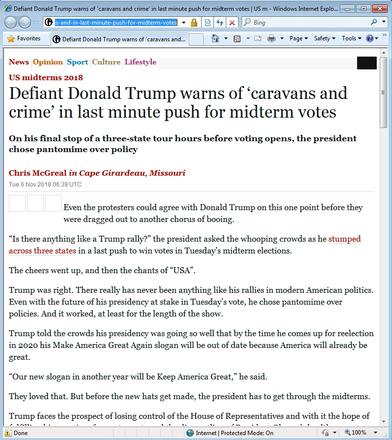
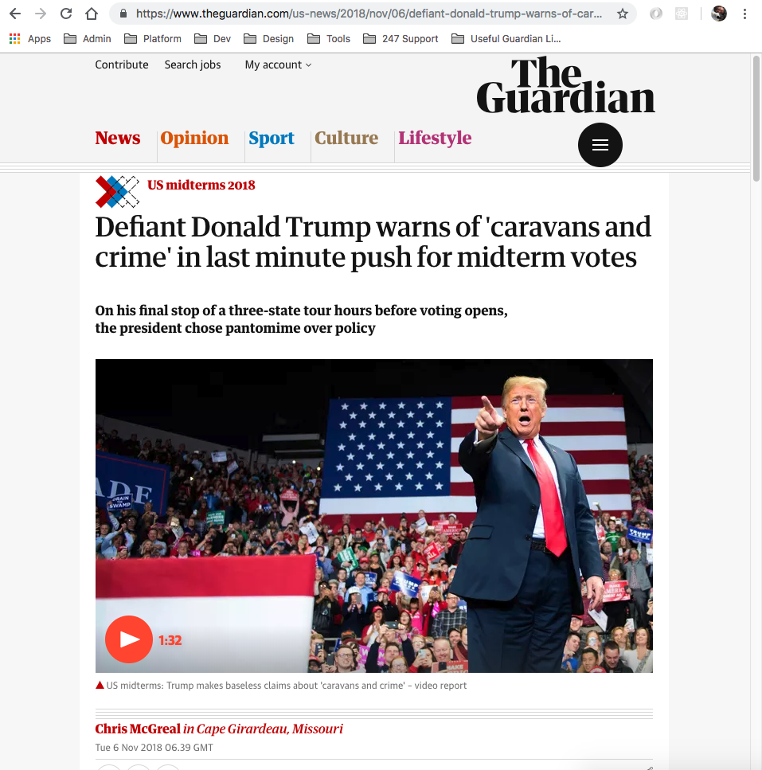

# Browser support principles

We believe that our journalism should be accessible to everyone.

**Note**: This documentation is out of date and requires and update, please badger the team to do that if you're reading this. GT - 23/06/2020

## Supported browsers

Most browsers will receive some sort of experience. A small minority don’t meet our security requirements
such as supporting TLS (IE<6, Firefox 1). These browsers will not be able to see theguardian.com.

## Recommended browsers

These are [browsers that we publicly recommend](https://www.theguardian.com/help/recommended-browsers) our
audience use. They will receive the modern experience.

If a browser supports [ES6 module script tags](https://caniuse.com/es6-module) **and** has more than 0.01% of traffic, it is considered to be a candidate for recommendation.

All browser versions above and including the minimum candidate version are considered recommended browsers.

As of 19th February 2024, our recommended browsers list is:

| Browser           | Min version |
| ----------------- | ----------- |
| Chrome            | 70          |
| Chrome (Android)  | 119         |
| Edge              | 109         |
| Firefox           | 78          |
| Firefox (Android) | 119         |
| Opera             | 95          |
| Opera (mobile)    | 73          |
| Safari            | 11.1        |
| Safari (iOS)      | 10.3        |
| Samsung Internet  | 17          |

The above table was calculated by [@guardian/browserslist-config](https://github.com/guardian/csnx/tree/main/libs/%40guardian/browserslist-config) based on data from Google Analytics.

## Cutting the mustard

_[Cutting the mustard](http://responsivenews.co.uk/post/18948466399/cutting-the-mustard)_ describes a technique that divides
web browsers in to two groups - 'modern' and 'core'.

We do this by evaluating the client's capability, like so:

```js
var isModern = (function () {
	'use strict';
	return Function.prototype.bind && !this;
})();
```

The _modern_ experience is designed to work on everything, whereas the _core_ experience is progressively enhanced with JavaScript.

For browsers that don't cut the mustard, we will deliver only the core experience. More modern browsers will receive the modern experience.

This ensures a graceful experience when viewing with a less capable device; or when, for whatever reason, the JavaScript fails we can
turn our [escalator into stairs](http://jakearchibald.com/2013/progressive-enhancement-still-important).

### Core experience

With the core experience, content is legible and styling is basic.

We will support some core JavaScript features:

-   tracking
-   error logging
-   commercial code
-   some simple identity checks, such as showing premium content for paying members
-   performance monitoring
-   scroll and resize throttling

The following screenshot is from dotcom-rendering running in IE8. The content is readable and images appear.
The pillar colours are visible. Links are clickable. However, it uses fallback fonts (mostly Georgia). The
logo, main media video and SVGs, notably the Guardian logo, are missing. The menu is static links with no
dropdown functionality. There is no onward content.



### Modern experience

All features. We may progressively enhance the experience with modern technologies that are not supported
in all browsers, such as CSS Grid. The site should look reasonable, even if modern tech is not available.



### Modern browsers

The following list is an approximate breakdown of browsers that will receive the modern experience.

| Browser           | Min version |
| ----------------- | ----------- |
| Chrome            | 19          |
| iOS Safari        | 6           |
| Firefox           | 4           |
| Safari            | 6           |
| Internet Explorer | 10          |
| Samsung Internet  | 4           |
| Edge              | 12          |
| UC Browser        | 11.8        |
| Opera             | 12.1        |
