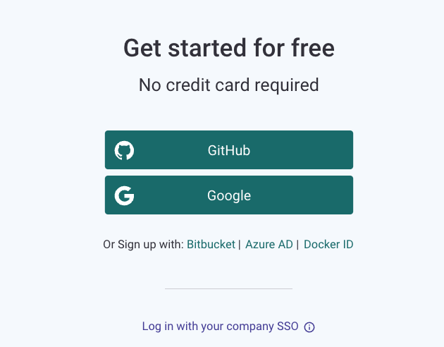
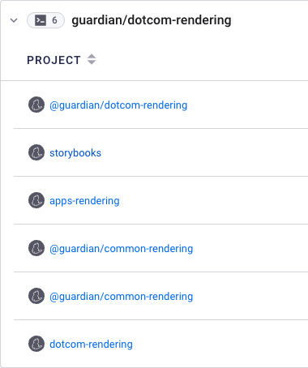
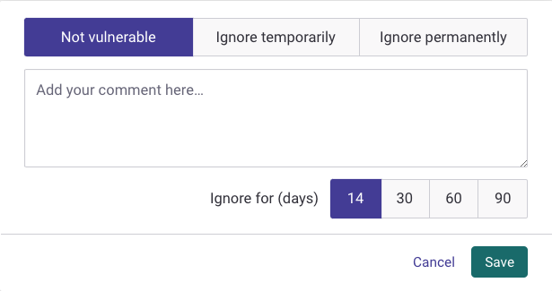

## Snyk how to guide

### Pre-requisite
Ask your EM or DevX to add you to `guardian-dotcom-n2y` Snyk organisation.

### How to log in
1. Make sure you are logged in your Guardian Google account.
2. Visit [https://app.snyk.io/login](https://app.snyk.io/login)
3. Either click on the Google button  or if you don't see this option click on "Log in with your company SSO", enter your Guardian Google email and proceed.

### What is the DCR Snyk dashboard structure?
The current Snyk structure



corresponds to the following DCR structure:

```
  dotcom-rendering (@guardian/dotcom-rendering)
     dotcom-rendering (dotcom-rendering)
     apps-rendering (apps-rendering)
     common-rendering (soon to be removed and deactivated in Snyk)
     storybooks (storybooks)
```

### How to run Snyk locally?

1. Install the Snyk CLI
   * using npm: `npm install snyk -g`
   * using yarn: `yarn global add snyk`
2. Authenticate your machine to associate the Snyk CLI with your Snyk account. There are currently two ways to do this locally:
   * Run `snyk auth`. This will open a browser window with prompts to log in to your Snyk account and authenticate. If you're already logged it, you will be authenticated automatically.
   * Using your API token. To do this follow the instructions in the [official documentation](https://docs.snyk.io/snyk-cli/authenticate-the-cli-with-your-account).
3. Run:
	* `make snyk` for `@guardian/dotcom-rendering`.
	* `make snyk-dcr` for `dotcom-rendering`
	* `make snyk-ar` for `apps-rendering`
    * `make snyk-storybooks` for `storybooks`

This is especially helpful if you want to know early in the development cycle whether you have fixed a vulnerability or to make sure you haven't introduced a new one.


### How to ignore a vulnerability?

By using the UI you can get the following options when you click "Ignore":


