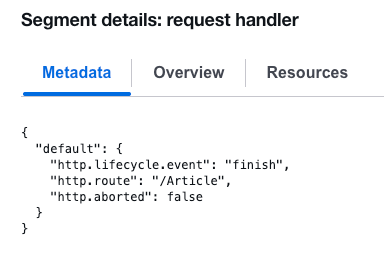

# Traces

AWS Cloudwatch Traces are added by `createRequestTracingMiddleware`. They can be viewed in the aws Cloudwatch console

If fetched using `aws xray batch-get-traces`, the trace document will contain a `Segment` field, which contains a
`Document` field. The `Document` field is a JSON string containing the trace data we want.

An example CLI request to view a single trace document as json is:

# Set date range

```
start="$(date -u -d '5 hours ago' +%s)"
end="$(date -u +%s)"
```

# List all services (currently only "tag-page-rendering")

```
aws xray get-service-graph \
  --start-time "$start" \
  --end-time "$end" \
  --query 'Services[].Name'
```

# List all traces for a specific service, time range, and path

```
aws xray get-trace-summaries \
  --start-time "$start" \
  --end-time "$end" \
  --filter-expression 'service("tag-page-rendering") AND http.url CONTAINS "/Article"' \
  --query 'TraceSummaries[].Id'
```

# Get full info from a single trace

```
aws xray batch-get-traces \
   --trace-ids 1-e805ee5f-1df00290c3be6a6cee361060 \
   | jq -r '.Traces[0].Segments[0].Document' \
   | jq '.'
```

It can be useful to add `metadata` to the trace document for use in the AWS UI.

For example, we add `subsegments[0].metadata.http.route` to the trace document so it is visible onscreen:



An example of a complete segment document is below. We are likely to be interested in the following sections:

- start_time (convert on a mac with `date -r <s>`)
- end_time
- metadata.default.http.request_content_length_uncompressed
- http.request.url and http.request.method

```
{
  "id": "7a193b1ebdceda4b",
  "name": "tag-page-rendering",
  "start_time": 1787914805.575,
  "trace_id": "1-e805ee5f-1df00290c3be6a6cee361060",
  "end_time": 1787914805.5822752,
  "fault": false,
  "error": false,
  "throttle": false,
  "http": {
    "request": {
      "url": "http://tag-page-rendering-jr.local.dev-gutools.co.uk/Article",
      "method": "POST",
      "user_agent": "curl/8.7.1",
      "client_ip": "10.0.20.50"
    },
    "response": {
      "status": 200,
      "content_length": 0
    }
  },
  "aws": {
    "xray": {
      "auto_instrumentation": false,
      "sdk_version": "2.8.0",
      "sdk": "opentelemetry for nodejs"
    }
  },
  "metadata": {
    "default": {
      "otel.resource.process.command": "/app/server.js",
      "otel.resource.telemetry.sdk.name": "opentelemetry",
      "http.request_content_length_uncompressed": 3466,
      "net.transport": "ip_tcp",
      "http.flavor": "1.1",
      "otel.resource.process.command_args": [
        "/usr/bin/node",
        "--require",
        "/app/instrumentation.js",
        "/app/server.js"
      ],
      "otel.resource.process.runtime.description": "Node.js",
      "otel.resource.host.arch": "arm64",
      "otel.resource.host.name": "ip-10-0-14-80.eu-west-1.compute.internal",
      "otel.resource.process.runtime.version": "24.20.0",
      "otel.resource.service.name": "tag-page-rendering",
      "net.host.ip": "::ffff:10.0.14.80",
      "otel.resource.process.executable.path": "/usr/bin/node",
      "otel.resource.telemetry.sdk.version": "2.8.0",
      "otel.resource.process.executable.name": "node",
      "otel.resource.process.owner": "node",
      "otel.resource.process.pid": 1,
      "http.status_text": "OK",
      "otel.resource.process.runtime.name": "nodejs",
      "otel.resource.telemetry.sdk.language": "nodejs"
    }
  },
  "subsegments": [
    {
      "id": "f6779849ceecde52",
      "name": "request handler",
      "start_time": 1787914805.576,
      "end_time": 1787914805.582691,
      "fault": false,
      "error": false,
      "throttle": false,
      "http": {
        "request": {
          "method": "POST"
        },
        "response": {
          "status": 200,
          "content_length": 0
        }
      },
      "aws": {
        "xray": {
          "auto_instrumentation": false,
          "sdk_version": "2.8.0",
          "sdk": "opentelemetry for nodejs"
        }
      },
      "metadata": {
        "default": {
          "http.lifecycle.event": "finish",
          "http.route": "/Article",
          "http.aborted": false
        }
      }
    },
    {
      "id": "c36bf9dd11b68a79",
      "name": "express.json",
      "start_time": 1787914805.575,
      "end_time": 1787914805.57525,
      "fault": false,
      "error": false,
      "throttle": false,
      "aws": {
        "xray": {
          "auto_instrumentation": false,
          "sdk_version": "2.8.0",
          "sdk": "opentelemetry for nodejs"
        }
      }
    }
  ]
}
```
