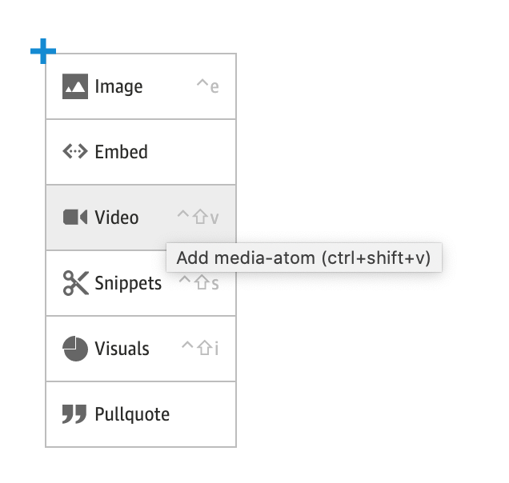
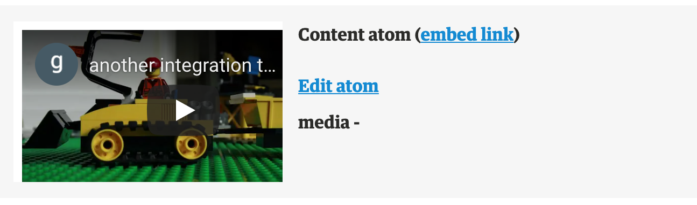
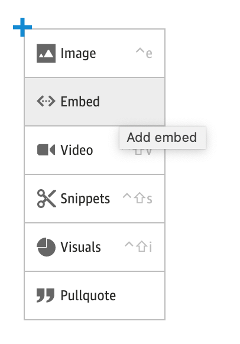
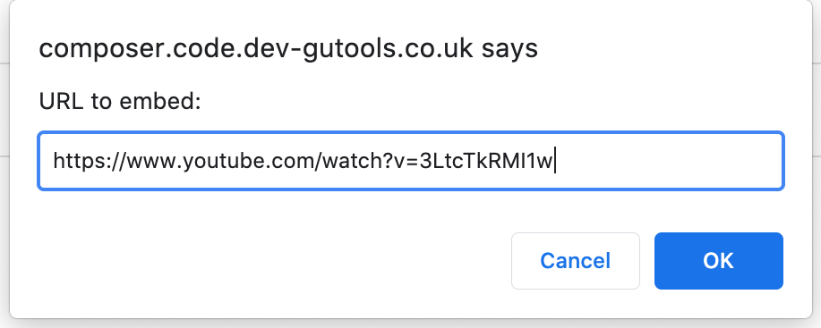
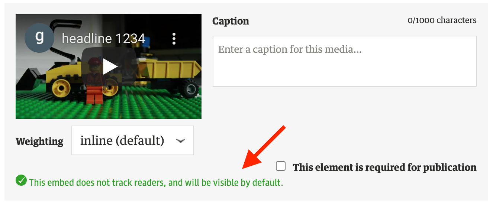
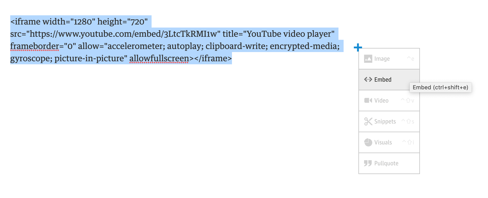
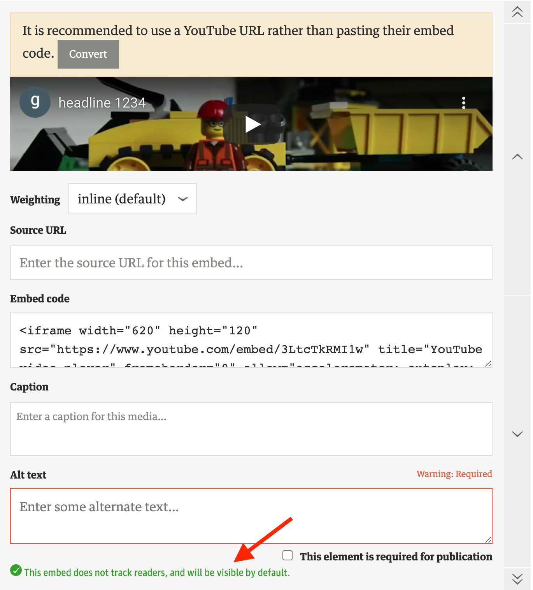

# YouTube Players on The Guardian

As of 17th November 2021

**Platform**|**Type1**|**Content / Element Type**|**Player Modules**|**adsConfig Modules**|**Domain from CAPI?**|**Domain2**|**Example4**
:-----|:-----|:-----|:-----|:-----|:-----|:-----|:-----
DCR|First party| |[YoutubeAtom](https://github.com/guardian/dotcom-rendering/blob/main/dotcom-rendering/src/components/YoutubeAtom/YoutubeAtom.tsx)|[ad-targeting.ts](https://github.com/guardian/dotcom-rendering/blob/34eee2a6f38f802ed30eb764a8bd7df1e54b07b5/dotcom-rendering/src/lib/ad-targeting.ts) [ad-targeting-youtube.ts](https://github.com/guardian/commercial-core/blob/9ed6f909d9b612241effc213d7a40342b1da96d3/src/ad-targeting-youtube.ts)| |youtube.com|[link](https://www.theguardian.com/world/2021/jun/24/hong-kong-apple-daily-queue-final-edition-newspaper)
| |Third party| |[YoutubeEmbedBlockComponent](https://github.com/guardian/dotcom-rendering/blob/main/dotcom-rendering/src/web/components/elements/YoutubeEmbedBlockComponent.tsx)|n/a| Y|youtube-nocookie.com|[link](https://www.theguardian.com/music/musicblog/2015/may/27/stone-roses-spike-island-the-reality)
 | | |Witness|[WitnessVideoBlockComponent](https://github.com/guardian/dotcom-rendering/blob/main/dotcom-rendering/src/web/components/elements/WitnessBlockComponent.tsx#L235)|n/a|Y|youtube.com|[link - no 15 ](https://www.theguardian.com/lifeandstyle/2015/aug/28/20-awesome-board-games-you-may-never-have-heard-of)
 | | |Interactives| | |?|youtube.com (in this example)|[link](https://www.theguardian.com/world/ng-interactive/2017/mar/10/the-internet-warriors-meet-the-trolls-in-their-own-homes-video)
 | | | MediaAtomBlockElement?| | |?|
 | | | MainMediaEmbedBlockComponent?| | |?|
DCR - AMP|First party| |[YoutubeBlockComponent](https://github.com/guardian/dotcom-rendering/blob/main/dotcom-rendering/src/amp/components/elements/YoutubeBlockComponent.tsx)|[ad-targeting.ts](https://github.com/guardian/dotcom-rendering/blob/34eee2a6f38f802ed30eb764a8bd7df1e54b07b5/dotcom-rendering/src/lib/ad-targeting.ts) | |youtube-nocookie.com|[link](https://amp.theguardian.com/world/2021/jun/24/hong-kong-apple-daily-queue-final-edition-newspaper)
| |Third party| |[VideoYoutubeBlockComponent](https://github.com/guardian/dotcom-rendering/blob/main/dotcom-rendering/src/amp/components/elements/VideoYoutubeBlockComponent.tsx)|n/a| |youtube-nocookie.com|[link](https://amp.theguardian.com/music/musicblog/2015/may/27/stone-roses-spike-island-the-reality)
Frontend|First party| |[youtube.scala.html](https://github.com/guardian/frontend/blob/main/common/app/views/fragments/atoms/youtube.scala.html)  [youtube-player.ts](https://github.com/guardian/frontend/blob/main/static/src/javascripts/projects/common/modules/atoms/youtube-player.ts)|[youtube-player.ts](https://github.com/guardian/frontend/blob/3bb4ab3976ba02b28b035b8186dc9b52eacce054/static/src/javascripts/projects/common/modules/atoms/youtube-player.ts#L165)| |youtube.com / youtube-nocookie.com 3|[link](https://www.theguardian.com/world/2021/jun/24/hong-kong-apple-daily-queue-final-edition-newspaper?dcr=false)
| |First party|Video Page|[youtube.scala.html](https://github.com/guardian/frontend/blob/main/common/app/views/fragments/atoms/youtube.scala.html)  [youtube-player.ts](https://github.com/guardian/frontend/blob/main/static/src/javascripts/projects/common/modules/atoms/youtube-player.ts)|[youtube-player.ts](https://github.com/guardian/frontend/blob/3bb4ab3976ba02b28b035b8186dc9b52eacce054/static/src/javascripts/projects/common/modules/atoms/youtube-player.ts#L165)| |youtube.com / youtube-nocookie.com 3|[link](https://www.theguardian.com/world/video/2021/jun/24/large-crowds-queue-in-hong-kong-for-final-apple-daily-edition-video)
 | |Third party| | [VideoEmbedCleaner.scala](https://github.com/guardian/frontend/blob/main/common/app/views/support/cleaner/VideoEmbedCleaner.scala)|n/a|?|youtube-nocookie.com|[link](https://www.theguardian.com/music/musicblog/2015/may/27/stone-roses-spike-island-the-reality?dcr=false)
 | |Third party?| Commercial Hosted - Atoms |[youtube-player.ts](https://github.com/guardian/frontend/blob/main/static/src/javascripts/projects/common/modules/atoms/youtube-player.ts)|[youtube-player.ts](https://github.com/guardian/frontend/blob/main/static/src/javascripts/projects/common/modules/atoms/youtube-player.ts)| | youtube.com|[link](https://www.theguardian.com/advertiser-content/microsoft-ai-for-earth/microsoft-ai-research)
 | |Third Party | Commercial Hosted - Embeds | [youtube-player.ts](https://github.com/guardian/frontend/blob/main/static/src/javascripts/projects/common/modules/atoms/youtube-player.ts)|[youtube-player.ts](https://github.com/guardian/frontend/blob/main/static/src/javascripts/projects/common/modules/atoms/youtube-player.ts)3| | youtube-nocookie.com|[link](https://www.theguardian.com/advertiser-content/radioactive-amazon-original-movie/radioactive)
Apps Rendering |First party iOS| |[nativeCommunication.ts](https://github.com/guardian/dotcom-rendering/blob/fcb2d6b958cce04a65498154e3a2ed91b7182d3e/apps-rendering/src/client/nativeCommunication.ts#L190-L216)|[AdRequestFactory.swift](https://github.com/guardian/ios-live/blob/9cf48e65f1874b1eb8457499ceda9af7ed9afa44/GLA/GLA/Classes/AdRequestFactory.swift#L109-L137) [YouTubeWrapper.swift](https://github.com/guardian/ios-live/blob/9cf48e65f1874b1eb8457499ceda9af7ed9afa44/GLA/GLA/Classes/YouTubeWrapper.swift#L268-L286)| |?|[web link](https://mobile.guardianapis.com/rendered-items/world/2021/jun/24/hong-kong-apple-daily-queue-final-edition-newspaper)
| |First party Android| |[nativeCommunication.ts](https://github.com/guardian/dotcom-rendering/blob/fcb2d6b958cce04a65498154e3a2ed91b7182d3e/apps-rendering/src/client/nativeCommunication.ts#L190-L216)|[YoutubeConfigProviderFactory.kt](https://github.com/guardian/android-news-app/blob/af31effada3dea118b1ffb3d5c5fde2e37393a93/android-news-app/src/main/java/com/guardian/feature/media/youtube/YoutubeConfigProviderFactory.kt#L25-L44)| |?|[web link](https://mobile.guardianapis.com/rendered-items/world/2021/jun/24/hong-kong-apple-daily-queue-final-edition-newspaper)
| |Third party| |[embed.ts](https://github.com/guardian/dotcom-rendering/blob/fcb2d6b958cce04a65498154e3a2ed91b7182d3e/apps-rendering/src/embed.ts#L89-L100)   [embed.tsx](https://github.com/guardian/dotcom-rendering/blob/fcb2d6b958cce04a65498154e3a2ed91b7182d3e/apps-rendering/src/components/embed.tsx#L36)   [video.tsx](https://github.com/guardian/dotcom-rendering/blob/fcb2d6b958cce04a65498154e3a2ed91b7182d3e/apps-rendering/src/components/video.tsx#L42)|n/a| |youtube-nocookie.com|[web link](https://mobile.guardianapis.com/rendered-items/music/musicblog/2015/may/27/stone-roses-spike-island-the-reality)
| |Generic Embed| |[embed.tsx](https://github.com/guardian/dotcom-rendering/blob/fcb2d6b958cce04a65498154e3a2ed91b7182d3e/apps-rendering/src/components/embed.tsx#L51)   [genericEmbed.tsx](https://github.com/guardian/dotcom-rendering/blob/fcb2d6b958cce04a65498154e3a2ed91b7182d3e/apps-rendering/src/components/genericEmbed.tsx#L35)|n/a| Y|youtube-nocookie.com|?
Editions (via Frontend) |First party| |[youtube-player.ts](https://github.com/guardian/frontend/blob/main/static/src/javascripts/projects/common/modules/atoms/youtube-player.ts)|[youtube-player.ts](https://github.com/guardian/frontend/blob/main/static/src/javascripts/projects/common/modules/atoms/youtube-player.ts)3||youtube-nocookie.com|[link](https://embed.theguardian.com/embed/atom/media/d59557c3-d588-46bc-b8a6-cd7b626cd1a6#noadsaf)

1 Previously `embed` was used to refer to third party videos `atom` for first party videos. This document uses the terms `first party video` and `third party video` to avoid confusion.

2 Third party YouTube videos that originate from Composer embeds _should_ use the domain `youtube-nocookie`. However for freeform content (e.g. interactives, witness) there is the possibility that this is not adhered to by the author.

3 Frontend's `youtube-player.ts` will default to the domain `youtube-nocookie.com` and no `adsConfig` object if an 'ad-free' setting is detected or if consent is not given.

4 To view the CAPI output for an article:
- [install Teleporter](https://s3-eu-west-1.amazonaws.com/gustaf-dist/composer/index.html)
- when viewing an article open Teleporter and click the 'content-api live' link.

# Composer and YouTube Embeds

In Composer an author can insert three types of embeds that contain YouTube videos:

## Atoms

Atoms (for first party videos) are inserted via the Media Atom Maker.

Atoms may be inserted as 'main' media or inline.

## YouTube embeds

YouTube embeds (for third party videos) are inserted by pasting the video URL into the embed dialog box.

## Generic embeds

Generic embeds (for third party videos) are inserted by pasting the embed code directly into the article, selecting the embed code and then clicking on the embed menu option.

Composer will warn the author that they should however use the YouTube URL to insert the embed.

## Composer and YouTube Domains

Composer and its update flow should ensure all YouTube embeds have their resulting CAPI fields (`'defaultHtml' | 'html' | 'sourceDomain'`) fields set to use `youtube-cookie.com`.

It is still however the consuming app's decision whether to use these fields or not.

In the case of first party videos this is typically ignored in order to pass through ad targeting - consent allowing.

